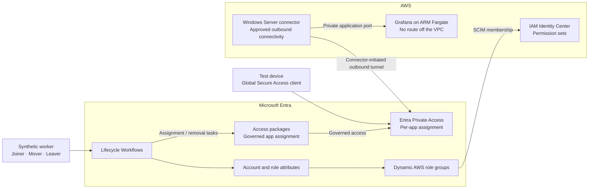

# Cross-Cloud Identity Lifecycle with Microsoft Entra Suite and AWS

Workforce lifecycle automation and identity-based access to a private AWS application. Follow a synthetic worker from baseline access before first sign-in, through a role change, to offboarding across Entra and AWS IAM Identity Center.

## Scope

- **Lifecycle:** reusable Joiner, Mover, and Leaver definitions; access packages; attribute-driven groups; SCIM; and measured access-removal delays.
- **Private Access:** one private target, a Private Network Connector, and per-app access governed through an access package.
- **Supporting infrastructure:** the existing IAM Identity Center federation and Terraform-managed permission sets remain in use.

## Target architecture

The diagram shows the access boundaries. The AWS footprint is deployed; the Private Access service is not yet registered. Existing Entra federation provides AWS sign-in. SCIM owns workforce users and AWS group memberships; Terraform owns permission sets and account assignments. Application reachability is tested separately from application authentication and existing-session termination.

## Implemented

| Phase | Outcome | Evidence |
| --- | --- | --- |
| 1 | Entra federation, SCIM provisioning, and temporary AWS console/CLI credentials | [worklog](worklogs/phase-1-entra-aws-federation.md) |
| 2 | Dynamic groups and a synthetic Joiner receiving baseline access before first sign-in | [worklog](worklogs/phase-2-identity-lifecycle-joiner.md) |
| 2 | Reusable Graph JSON workflow deployment; tenant values kept in ignored local copies | [worklog](worklogs/phase-2-lifecycle-workflows-as-code.md) |
| 3 | Three Terraform-managed permission sets and account assignments | [worklog](worklogs/phase-3-terraform-identity-center.md) |
| 4 | Private VPC footprint with Grafana on ARM Fargate, reachable only from the connector | [worklog](worklogs/phase-4-private-access-footprint.md) |

## Remaining work

| Phase | Scope |
| --- | --- |
| 0–2 | Close readiness gaps and capture Joiner timing evidence |
| 4 | Register the connector against the deployed target and verify the reachability boundary |
| 5 | Publish per-app Private Access and validate governed allow/deny paths |
| 6 | Validate Mover changes across AWS and private-access entitlements |
| 7 | Validate Leaver behavior, existing sessions, evidence, and teardown |
