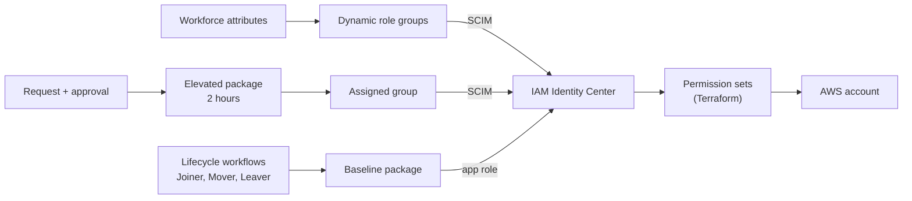

# Cross-cloud workforce identity: Microsoft Entra and AWS

This lab governs workforce access to AWS through Microsoft Entra:

- SAML federation and SCIM provisioning into IAM Identity Center
- Attribute-driven AWS role groups
- Terraform-managed permission sets
- Access packages with approval and expiry
- Joiner, Mover, and Leaver workflows, validated end to end
- Private AWS access through Entra Private Access

## Architecture

| Access | Owned by |
| --- | --- |
| AWS role-group membership | Workforce attributes and dynamic rules |
| Elevated group membership | Elevated access package |
| Identity Center app access | Baseline access package |
| Groups | [Graph Bicep](entra/groups/) |
| Permission sets and account assignments | [Terraform identity root](terraform/README.md) |
| Administrative recovery | Separate identities, outside persona packages |

## Results

| Phase | Result | Evidence |
| --- | --- | --- |
| 0. Readiness | Toolchain confirmed; superseded drafts removed | [Phase 0](worklogs/phase-0-readiness.md) |
| 1. Federation | Entra SAML and SCIM; temporary console and CLI credentials | [Phase 1](worklogs/phase-1-entra-aws-federation.md) |
| 2. Lifecycle foundation | Dynamic role groups, baseline package, first Joiner | [Phase 2](worklogs/phase-2-identity-lifecycle-joiner.md) |
| 3. Permission sets | Terraform permission sets and account assignments | [Phase 3](worklogs/phase-3-terraform-identity-center.md) |
| 4. Private target | Isolated VPC, connector, and Grafana on Fargate (torn down) | [Phase 4](worklogs/phase-4-private-access-footprint.md) |
| 5. Private Access | Grafana reached from an Entra-joined client, with no VPN or peering | [Phase 5](worklogs/phase-5-private-access-assignment.md) |
| 6. Access packages | Baseline package and approved, time-limited elevated package | [Phase 6](worklogs/phase-6-access-packages.md) |
| 7. Joiner, Mover, Leaver | One persona through the full lifecycle, measured in Entra and AWS | [Phase 7](worklogs/phase-7-jml-lifecycle.md) |

## Lifecycle at a glance

| Event | Measured result |
| --- | --- |
| Joiner | Baseline access delivered 55 s after enablement, before first sign-in |
| Elevation | Request denied, then approved; access removed on revocation |
| Role change | Dynamic groups switched 24 s after the title change; elevation kept |
| Leaver containment | Account disabled first; new sign-in blocked within 1 minute |
| Leaver in AWS | SCIM disabled the user 10 minutes after disablement |
| Existing AWS sessions | Stay valid until the permission set session ends |

The AWS footprint from Phases 4 and 5 is torn down. Only the identity Terraform root is active.

## Repository layout

| Path | Contents |
| --- | --- |
| [`worklogs/`](worklogs/) | Phase evidence with screenshots |
| [`decisions.md`](decisions.md) | Architecture decision records |
| [`entra/groups/`](entra/groups/) | Graph Bicep for dynamic and assigned groups |
| [`terraform/`](terraform/README.md) | Identity Center permission sets |
| [`app/`](app/README.md) | Grafana private target from Phase 4 |
| [`.github/workflows/`](.github/workflows/) | Secret scan |
