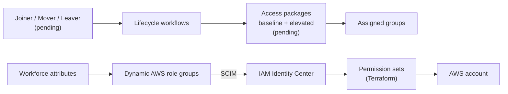

# Cross-cloud workforce identity: Microsoft Entra and AWS

This lab governs workforce access to AWS through Microsoft Entra:

- Federation and SCIM into IAM Identity Center
- Attribute-driven AWS role groups
- Terraform-managed permission sets
- Access packages and synthetic Joiner, Mover, and Leaver (JML) personas

> **In progress:** Access packages and JML validation are pending. Only the Joiner has evidence. Baseline and elevated packages, Mover, and Leaver aren't validated yet.

## Architecture

| Access | Owned by |
| --- | --- |
| AWS role-group membership | Workforce attributes and dynamic rules |
| Permission sets and account assignments | [Terraform identity root](terraform/README.md) |
| Assigned group membership | Access packages |
| Administrative recovery | Separate identities, outside persona packages |

## Status

| Area | Result | Evidence |
| --- | --- | --- |
| Federation | Entra SAML, SCIM, and temporary AWS console and CLI credentials | [Phase 1](worklogs/phase-1-entra-aws-federation.md) |
| Joiner | Baseline package delivered and AWS provisioning observed before first sign-in | [Phase 2 Joiner](worklogs/phase-2-identity-lifecycle-joiner.md) |
| Workflow tooling | Workflows deployed from JSON; Mover and Leaver not validated; tooling retired | [Phase 2 tooling](worklogs/phase-2-lifecycle-workflows-as-code.md) |
| AWS roles | Three Terraform permission sets and account assignments | [Phase 3](worklogs/phase-3-terraform-identity-center.md) |
| Private target | Private VPC, connector, and Grafana on Fargate (torn down) | [Phase 4](worklogs/phase-4-private-access-footprint.md) |
| Private Access | Grafana reached from an Entra-joined client with no VPN or peering | [Phase 5](worklogs/phase-5-private-access-assignment.md) |
| Access packages | Pending | [Roadmap](docs/roadmap.md#access-packages-and-jml) |
| Mover and Leaver | Pending | [Acceptance criteria](docs/roadmap.md#persona-acceptance-criteria) |

The AWS footprint is down. Only the identity Terraform root is active.

## Next steps

1. Inventory tenant packages, policies, assignments, workflows, and personas.
1. Define package ownership, approvals, expiry, and recovery.
1. Validate the baseline and elevated packages.
1. Validate the Joiner, Mover, and Leaver personas.
1. Automate only the validated operations.

See the [roadmap](docs/roadmap.md) for details. Check live AWS and Entra state before you change tenant resources.

## Repository layout

| Path | Contents |
| --- | --- |
| [`docs/roadmap.md`](docs/roadmap.md) | Remaining work and acceptance criteria |
| [`decisions.md`](decisions.md) | Architecture decision records |
| [`worklogs/`](worklogs/) | Phase evidence with screenshots |
| [`terraform/`](terraform/README.md) | Identity Center permission sets |
| [`entra/lifecycle-workflows/`](entra/lifecycle-workflows/README.md) | Joiner workflow reference |
| [`app/`](app/README.md) | Historical Grafana private target |
