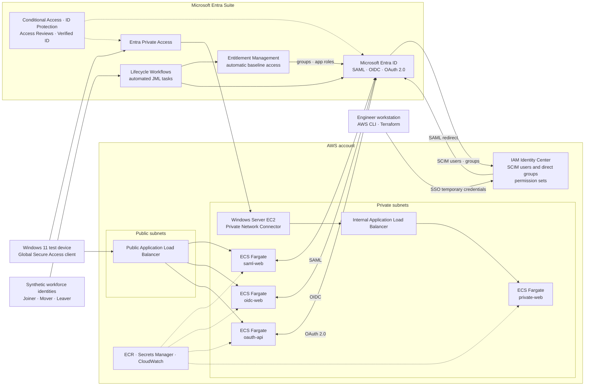

# Cross-Cloud Identity with Microsoft Entra Suite and AWS

Microsoft Entra Suite governs synthetic workforce identities and the AWS access they receive. A Joiner is created, given baseline entitlements before first sign-in, provisioned into AWS IAM Identity Center over SCIM, and later moved and deprovisioned, with every step reproducible from this repository.

## Architecture

Terraform never creates or mutates a workforce identity. SCIM owns the IAM Identity Center users and group memberships; Terraform looks those groups up by display name and owns only the permission sets and account assignments.

## Done

| Phase | Outcome | Evidence |
| --- | --- | --- |
| 1 | Entra ID is the external SAML identity provider for IAM Identity Center. SCIM provisions the dynamic administrator group and its member. Federated console and CLI access work with temporary credentials. | [worklog](worklogs/phase-1-entra-aws-federation.md) |
| 2 | Four attribute-driven security groups deploy through Graph Bicep. A synthetic Joiner receives the baseline access package before first sign-in and reaches IAM Identity Center over SCIM. | [worklog](worklogs/phase-2-identity-lifecycle-joiner.md) |
| 2 | Joiner, Mover, and Leaver workflows deploy from version-controlled Graph JSON with no tenant object IDs committed. | [worklog](worklogs/phase-2-lifecycle-workflows-as-code.md) |
| 3 | Terraform owns three permission sets and their account assignments. The unmanaged bootstrap permission set is gone. | [worklog](worklogs/phase-3-terraform-identity-center.md) |

## Upcoming

| Phase | Scope |
| --- | --- |
| 4 | VPC across two Availability Zones, public and private subnets, and a reviewed egress design |
| 5 | ECS cluster, ECR repositories, log groups, task roles, and empty secret containers |
| 6 | First Fargate service in private subnets, with health checks and rollback |
| 7 | Public `saml-web`, `oidc-web`, and `oauth-api` behind HTTPS, plus the Mover run that swaps entitlements and claims |
| 8 | Private `private-web` behind an internal load balancer with no public route |
| 9 | Entra Private Access connector on a Windows Server EC2 host, publishing `private-web` per app |
| 10 | Conditional Access, access reviews, ID Protection, and Verified ID scenarios |
| 11 | Leaver run, end-to-end JML trace, CI checks, and teardown |
