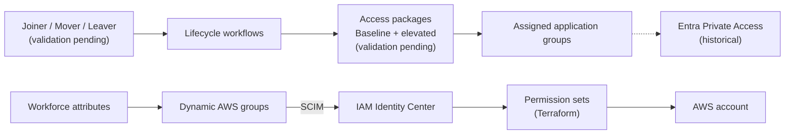

# Cross-cloud workforce identity: Microsoft Entra and AWS

An identity lab that governs workforce access to AWS through Microsoft Entra: federation and SCIM into IAM Identity Center, attribute-driven AWS roles, Terraform-managed permission sets, Entra Private Access, and access packages with synthetic Joiner/Mover/Leaver personas.

> **In progress / pending:** access packages and JML (Joiner/Mover/Leaver) validation are the remaining work. Baseline/elevated package behavior and the Mover and Leaver personas have **not** been validated yet; only the historical Joiner result below has evidence.

## Scope

No additional AWS resources will be added. The planned ECS API, RDS database, Grafana SSO, dashboards, and the retained foundation and disposable lab Terraform roots are out of scope.

What remains:

- **Access packages:** verify the catalog, baseline/elevated package resource roles, policies, approvals, and expiry against the governance contract in the [roadmap](docs/roadmap.md#access-packages-and-jml).
- **JML validation:** evidence all three synthetic personas end to end, then automate only the validated operations.

The previous deployment helpers and unvalidated Mover/Leaver templates have been removed so they can be replaced against a defined access model and acceptance criteria. The validated Joiner definition remains a [historical reference](entra/lifecycle-workflows/README.md).

## Current status

The AWS lab footprint is down. The active [Terraform root](terraform/README.md) holds retained identity resources only: IAM Identity Center permission sets and account assignments. The previous private-target module and anonymous Grafana image remain as reference code and are not deployed.

The [roadmap](docs/roadmap.md) and [ADR-023](decisions.md#adr-023-build-an-aws-operations-lab-with-governed-workforce-access) were written for the broader AWS operations lab. Their AWS workload phases no longer apply; their access package and JML sections remain the reference for the remaining work. Live AWS/Entra inventory must be checked before changing or cleaning up tenant resources.

## Architecture

Access packages govern assigned application-group membership. Dynamic AWS role groups keep their existing attribute-based ownership, and Terraform owns permission sets and account assignments. AWS administrative access must stay independent of package-managed persona access.

## Existing evidence

These are historical results, not a claim that the environment is currently deployed.

| Area | Observed result | Evidence |
| --- | --- | --- |
| Federation | Entra federation, SCIM, and temporary AWS console/CLI credentials | [Phase 1](worklogs/phase-1-entra-aws-federation.md) |
| Joiner | Baseline access package delivered and AWS provisioning observed before first interactive sign-in | [Phase 2 Joiner](worklogs/phase-2-identity-lifecycle-joiner.md) |
| Workflow tooling | Definitions deployed; Mover package swap and Leaver execution were not validated; tooling now retired | [Phase 2 tooling](worklogs/phase-2-lifecycle-workflows-as-code.md) |
| AWS roles | Three Terraform-managed permission sets and account assignments | [Phase 3](worklogs/phase-3-terraform-identity-center.md) |
| Infrastructure | Private VPC, connector, and ARM Fargate Grafana target (since torn down) | [Phase 4](worklogs/phase-4-private-access-footprint.md) |
| Private Access | Grafana reached from an Entra-joined client with no VPN or peering to AWS | [Phase 5](worklogs/phase-5-private-access-assignment.md) |

The previous unassigned-client denial test and application reachability across a role move remain unproven.

## Next steps (pending)

1. Inventory tenant access packages, policies, resource roles, assignments, workflows, and existing personas.
2. Define package/persona ownership, eligibility, approvals, expiry, and administrative recovery.
3. Validate the baseline and elevated access packages.
4. Validate the Joiner, Mover, and Leaver personas against the [acceptance criteria](docs/roadmap.md#persona-acceptance-criteria).
5. Automate only the validated operations, with dry-run output, repeat-run behavior, and negative-case tests.

Start with the [roadmap](docs/roadmap.md#access-packages-and-jml), not the old worklogs' deployment commands.
