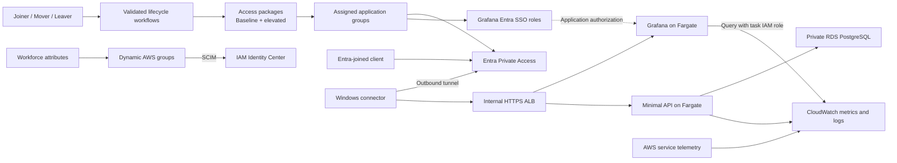

# AWS application platform with Microsoft Entra and Grafana

An AWS infrastructure and identity lab: operate a minimal ECS application backed by RDS, monitor it with private Grafana, and govern workforce access through Microsoft Entra.

The next build combines two connected areas:

- **AWS operations:** Fargate deployments, PostgreSQL, useful dashboards, scaling, failure diagnosis, recovery, and repeatable teardown.
- **Identity governance:** access packages, synthetic Joiner/Mover/Leaver personas, attribute-driven AWS roles, SCIM, Entra Private Access, and Grafana SSO.

Access packages and all three personas remain in scope. The previous deployment helpers and unvalidated Mover/Leaver templates have been removed so they can be replaced against a defined access model and acceptance criteria. The validated Joiner definition remains a [historical reference](entra/lifecycle-workflows/README.md).

## Current status

The AWS lab footprint is down. The repository still contains the previous private-target infrastructure and anonymous Grafana image; the ECS API, RDS, Grafana SSO, dashboards, and replacement governance automation are **planned, not implemented**.

The [roadmap](docs/roadmap.md) is the tracked implementation plan. [ADR-023](decisions.md#adr-023-build-an-aws-operations-lab-with-governed-workforce-access) records the scope reset. Live AWS/Entra inventory must be checked before rebuilding or cleaning up tenant resources.

## Planned architecture

Private Access controls network reachability; Grafana SSO controls application roles. Access packages govern assigned application-group membership. Dynamic AWS role groups keep their existing attribute-based ownership. Lab teardown must preserve administrative access and retained foundation resources.

## Existing evidence

These are historical results, not a claim that the environment is currently deployed.

| Area | Observed result | Evidence |
| --- | --- | --- |
| Federation | Entra federation, SCIM, and temporary AWS console/CLI credentials | [Phase 1](worklogs/phase-1-entra-aws-federation.md) |
| Joiner | Baseline access package delivered and AWS provisioning observed before first interactive sign-in | [Phase 2 Joiner](worklogs/phase-2-identity-lifecycle-joiner.md) |
| Workflow tooling | Definitions deployed; Mover package swap and Leaver execution were not validated; tooling now retired | [Phase 2 tooling](worklogs/phase-2-lifecycle-workflows-as-code.md) |
| AWS roles | Three Terraform-managed permission sets and account assignments | [Phase 3](worklogs/phase-3-terraform-identity-center.md) |
| Infrastructure | Private VPC, connector, and ARM Fargate Grafana target | [Phase 4](worklogs/phase-4-private-access-footprint.md) |
| Private Access | Grafana reached from an Entra-joined client with no VPN or peering to AWS | [Phase 5](worklogs/phase-5-private-access-assignment.md) |

The previous unassigned-client denial test and application reachability across a role move remain unproven. The new roadmap includes explicit access-layer tests and JML evidence.

## Next delivery steps

1. Inventory access/state and define the package/persona ownership model.
2. Separate retained resources from disposable lab infrastructure.
3. Build the minimal ECS/RDS workload and private Grafana with SSO and dashboards.
4. Validate baseline/elevated access packages and the three personas against the working platform, then automate the proven operations.
5. Demonstrate failures, scaling, recovery, CI deployment, and teardown/rebuild.

Prepare locally, deploy for short lab windows, and record the retained costs afterward. Start with the [roadmap](docs/roadmap.md), not the old worklogs' deployment commands.
