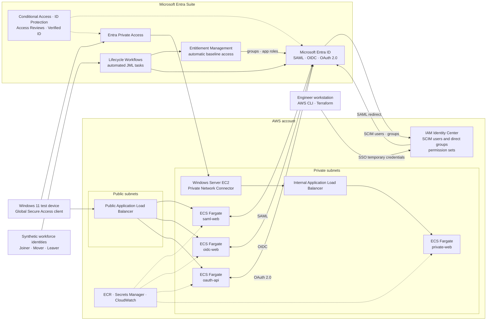

# Cross-Cloud Identity with Microsoft Entra Suite and AWS

This project demonstrates cross-cloud workforce identity, authentication protocols, lifecycle governance, and private application access. Microsoft Entra Suite governs synthetic workforce identities and protects container workloads running on Amazon ECS.

Repository: `entra+aws`

> **Status:** Planning. The documentation baseline is written and Phase 0, prerequisites and environment readiness, is in progress. Nothing has been provisioned. Follow [`plan.md`](plan.md) and complete one verified phase at a time.

## Target architecture

## Tool boundaries

| Area | Tool | Responsibility |
| --- | --- | --- |
| AWS infrastructure | Terraform | IAM Identity Center permission sets and assignments, VPC, load balancers, ECS, ECR, IAM roles, logs, secret containers, and the connector EC2 host |
| AWS workforce identities | Entra provisioning service and SCIM | Users and direct group memberships in the IAM Identity Center identity store |
| Entra applications | Microsoft Graph Bicep | Applications, service principals, scopes, roles, redirects, and supported assignments |
| Entra governance | Microsoft Graph and PowerShell | Synthetic identities, access packages, Lifecycle Workflows, Private Access, Conditional Access, protection, and unsupported Bicep resources |
| Applications | Containers on ECS Fargate | Protocol demonstrations and safe request/token inspection |
| Interactive work | AWS and Entra portals | Root-only tasks, the bootstrap permission set, initial federation and SCIM secrets, consent, connector enrollment, and validation where automation is unsuitable |

## Goals

- Use SAML, OIDC, and OAuth 2.0 through working applications.
- Implement Joiner, Mover, and Leaver (JML) controls throughout the project.
- Assign baseline access automatically before a test user's first sign-in.
- Federate Microsoft Entra ID with AWS IAM Identity Center and provision users and groups through SCIM.
- Inspect protocol requests, responses, claims, and authorization decisions without logging raw credentials.
- Run application containers on Amazon ECS with AWS Fargate.
- Protect a private ECS application with Microsoft Entra Private Access.
- Add governance, risk, and verification scenarios from Microsoft Entra Suite.
- Keep the repository reusable and free of tenant IDs, account IDs, credentials, and secret values.

## Prerequisites

### AWS account and access

- An AWS account with access to its root email address, recovery phone, and MFA device.
- An existing administrative sign-in that remains available until federated access is tested.
- Permission to enable IAM Identity Center, configure the identity source, create permission sets, manage the project resources, and configure AWS Budgets.
- AWS Organizations management-account access only if the optional service control policy revocation scenario is implemented.

The root user is the account owner, not the normal deployment identity. Protect it with MFA, create no root access keys, and use it only for tasks that AWS documents as root-only.

### Microsoft cloud

- A Microsoft Entra tenant with a Microsoft Entra Suite trial or equivalent individual licenses assigned to the in-scope test users.
- A dedicated administrative identity protected by MFA.
- Least-privileged roles for the implemented phases, including Lifecycle Workflows Administrator, Identity Governance Administrator, Application Administrator, Conditional Access Administrator, and Global Secure Access Administrator where required.
- An Azure subscription only if the optional Lifecycle Workflows custom task extension and Logic App are implemented.
- A Windows 11 test device for the Global Secure Access client and Private Access validation.
- A recorded trial start and expiry date, so licence-dependent phases run before the trial lapses.

### DNS and certificates

- A DNS domain for the public application host names, either registered in Route 53 or delegated from an external registrar.
- Host names reserved for `saml-web`, `oidc-web`, `oauth-api`, and `private-web`.
- An AWS Certificate Manager public certificate validated through DNS.

These are prerequisites rather than later details. SAML assertion consumer service URLs, OIDC redirect URIs, and the HTTPS load-balancer listener all depend on names that must not change after the Entra applications are registered.

### Local workstation

- Git
- Terraform; Phase 3 pins the version when the AWS configuration is created
- AWS CLI v2
- Docker with BuildKit, reachable from the working shell
- Azure CLI and Bicep
- PowerShell 7 and the required Microsoft Graph modules
- `jq`

Record the installed versions during Phase 0. The workstation CPU architecture also determines whether container images are built natively for the chosen Fargate CPU architecture or cross-built, so decide that before the first image is built.

## AWS bootstrap sequence

1. Sign in as root only to verify recovery details, enable MFA, and confirm that no root access keys exist.
2. Sign out of root and use the existing administrative identity for bootstrap work.
3. Enable IAM Identity Center and configure Microsoft Entra ID as its external identity provider.
4. Configure SCIM, provision the administrative Entra group, and interactively assign one short-session bootstrap permission set. Phase 3 imports or replaces it before Terraform becomes authoritative.
5. Configure an AWS CLI SSO profile named `cross-cloud-admin` and verify both console and CLI access.
6. Retain the previous administrative path until the federated path has been tested. Remove long-lived access only through a separate reviewed change.

## AWS access baseline

- Use the AWS root user only for tasks that require root credentials.
- Protect root with MFA and never create root access keys.
- Federate IAM Identity Center with Microsoft Entra ID for console and CLI access.
- Use temporary credentials from the `cross-cloud-admin` SSO profile for Terraform.
- Keep the existing administrative path until federated console and CLI access are tested.
- Let SCIM own IAM Identity Center users and group memberships; Terraform must not mutate them.
- Do not paste account IDs, role ARNs, access keys, or CLI output into committed files or worklogs.

## Working method

1. Work on one phase from [`plan.md`](plan.md).
2. Stop if access, cost, security, or Terraform output is unclear.
3. Validate the phase against its exit criteria.
4. Write a redacted worklog entry.
5. Mark the phase `Done` only after validation succeeds.

## Documentation

- [`plan.md`](plan.md): ordered implementation phases and completion criteria.
- [`decisions.md`](decisions.md): accepted planning and architecture decisions with documented alternatives.
- [`worklogs/README.md`](worklogs/README.md): worklog naming and entry template.
- `scripts/check-prereqs.sh`: reports the local toolchain state for Phase 0.

The project uses local Terraform state. State, private variable files, generated credentials, tokens, and deployment-specific parameter files stay outside version control.
