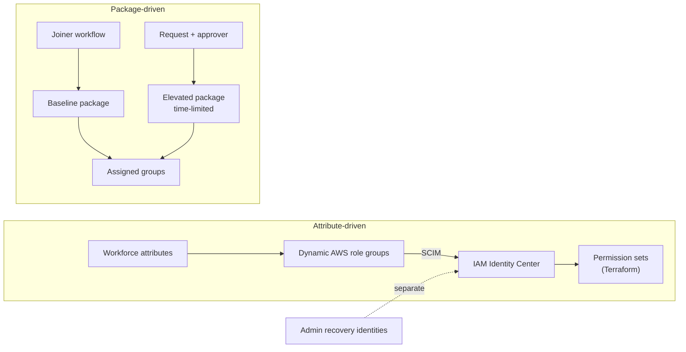

# Roadmap: access packages and JML

Updated 2026-09-13. Items stay unchecked until they have evidence.

## Goal

Show that access packages and lifecycle workflows govern workforce access across Entra and AWS, with end-to-end evidence for each persona.

## Access packages and JML

### Package model

| Object | Owner and behavior |
| --- | --- |
| AWS role-group membership | Workforce attributes and dynamic rules. SCIM syncs users and groups. |
| Permission sets and account assignments | Terraform identity root |
| Assigned group membership | Access packages |
| Baseline package | Assigned by the Joiner workflow. No approval. |
| Elevated package | Requested, approved by a named approver, and time-limited. Adds to baseline; expiry leaves baseline in place. |
| Administrative recovery | Separate identities and assignments, outside persona packages |

Rules:

- Give each membership one writer. Don't leave manual membership on a package-managed persona.
- Use assigned groups for package resources. Entitlement management can't write to dynamic groups. See [access package resources](https://learn.microsoft.com/en-us/entra/id-governance/entitlement-management-access-package-resources).
- Route elevated access through approval. An admin direct assignment must not bypass it. See [request policies](https://learn.microsoft.com/en-us/entra/id-governance/entitlement-management-access-package-request-policy).
- Keep AWS administrative access independent of the elevated package.

For each package, record:

- Catalog and owner
- Resource roles
- Eligible requestors and assignment mechanism
- Approver and fallback
- Expiry and extension rules
- Cleanup behavior

### Persona acceptance criteria

| Persona | Required evidence |
| --- | --- |
| Joiner | Starts disabled with synthetic attributes and a manager. Gets baseline access before first sign-in. Reaches the intended AWS role. Record the enablement and delivery order. |
| Mover | AWS role change from attributes, measured separately from package elevation. Approved, denied, and pending requests. Return to baseline after expiry or removal. |
| Leaver | Account disabled first. Sessions revoked. Entitlements removed. SCIM deactivation and new sign-in denial verified. Existing AWS sessions measured separately. |

Use isolated synthetic identities with fixed attributes. Never run bulk package removal against an administrative identity.

### Automation requirements

Automate an operation only after you validate it manually. The automation must:

- Take explicit configuration and resolve objects unambiguously, with no silent fallback.
- Show the intended changes before it writes.
- Keep tenant IDs and secrets in ignored local files.
- Create no duplicates on a repeat run.
- Fail with an actionable message for missing objects, denied requests, expiry, throttling, and interrupted runs.
- Verify delivered access, not just request acceptance or workflow completion.
- Disable the account even if cleanup fails.

Keep schedules off until on-demand runs pass.

## Delivery plan

### 1. Inventory and define

- [x] Remove the old deploy and export helpers and the unvalidated Mover and Leaver templates. Keep the Joiner reference.
- [x] Separate the identity Terraform root.
- [ ] Inventory workflows, schedules, packages, policies, resource roles, assignments, and personas.
- [ ] Verify an administrative recovery path.
- [ ] Define package ownership, eligibility, approvals, expiry, and recovery.
- [ ] Confirm Entra licensing for entitlement management and Lifecycle Workflows.

### 2. Validate access packages

- [ ] Verify the catalog, resource roles, policies, and assignments against the package model.
- [ ] Confirm the existing baseline package before you change it.
- [ ] Create or verify the elevated package, including approval and expiry.

### 3. Validate personas

- [ ] **Joiner:** capture enablement, package delivery, group membership, and SCIM timestamps before first sign-in.
- [ ] **Mover:** capture approved elevation, a denied or pending request, and expiry. Measure the attribute-driven AWS change separately.
- [ ] **Leaver:** capture disablement, revocation, assignment removal, SCIM deactivation, new sign-in denial, and remaining sessions.

### 4. Automate validated operations

- [ ] Automate each validated operation with dry-run output, repeat-run checks, and negative-case tests.
- [ ] Enable schedules only after on-demand runs and recovery pass.

**Exit criteria:** Baseline and elevated package behavior and all three personas have end-to-end evidence. A successful API call or workflow run alone doesn't count.

## Known evidence gaps

- The historical Joiner enabled the account before it requested the package. It proves delivery before first sign-in, not delivery while disabled.
- Private Access denial for an unassigned identity wasn't observed.
- Application reachability across a role move wasn't observed.
