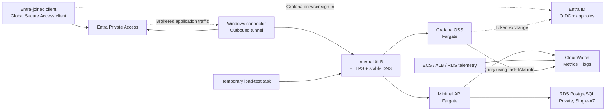

# AWS application platform with Entra access and Grafana

Tracked implementation roadmap, updated 2026-09-10. Checked items describe repository preparation only; platform and tenant changes remain pending.

## Direction

Build and operate a small AWS application platform: a minimal API on ECS Fargate, PostgreSQL on RDS, and Grafana that helps explain how the system behaves under load and during failures. Entra remains the workforce identity and private-access layer. Access packages and synthetic Joiner/Mover/Leaver personas remain required outcomes alongside the AWS work. Replace the unfinished automation with a small, validated governance implementation; the project is no longer exclusively a JML demonstration.

Confirmed preferences:

- Keep application code minimal; spend the effort on infrastructure and operations.
- Keep Grafana reachable only through Entra Private Access.
- Run short lab sessions and tear down the paid lab footprint afterward.
- Keep access packages and all three JML personas. Remove unused/incomplete implementations, not the governance scope.

The first useful outcome is simple: sign into a private Grafana instance through Entra, generate traffic against an API that actually uses RDS, and identify a problem from its dashboards and logs.

This is a new roadmap. Historical phase numbers and completed evidence remain historical. The README and ADR-023 describe this reset; earlier ADRs and worklogs retain the previous scope as history. Do not mark unfinished JML tests complete.

## Starting point

The AWS lab footprint has been torn down. Repository inspection confirms the old design, not the current cloud inventory:

- Entra federation, SCIM, dynamic AWS groups, and Terraform permission sets already have evidence.
- The old AWS module combines a Windows connector, isolated Fargate target, ECR, and networking behind one switch.
- The current Grafana image enables anonymous viewing. It has no useful monitoring configuration or application SSO.
- The old target's egress covers image pulls and logs. Entra token exchange and CloudWatch queries need additional connectivity.
- Previous teardown removed the project's administrative account assignments. Old notes also describe orphaned permission sets and Terraform state drift. Verify current reality before attempting recovery.
- Private Access reachability was demonstrated. The unassigned-client denial and application access across a role move were not demonstrated.

Preserve existing worklogs, screenshots, and the validated Joiner definition as evidence. Retire the custom deploy/export framework and unfinished Mover/Leaver templates; rebuild their required outcomes against the governance contract below.

## What stays, changes, and goes

| Area | New direction |
| --- | --- |
| Entra -> IAM Identity Center federation and SCIM | Keep for human AWS access. Verify it still works. |
| Terraform permission sets | Keep, with state and teardown boundaries independent of lab infrastructure. |
| Entra Private Access | Keep for private Grafana access, using a stable hostname instead of a task IP. |
| Grafana | Promote from reachability target to authenticated operations console. |
| Lifecycle/entitlement scripts | Custom deploy/export/common helpers and unvalidated Mover/Leaver templates removed. Keep the Joiner definition unchanged as a historical reference; replace automation only after validating its operations. |
| Access packages and JML personas | Required scope: validate baseline/elevated package policies and all three persona outcomes. Inventory existing tenant resources; remove only unused/incomplete resources after dependency checks. |
| AWS role groups | Keep where useful; do not redesign working AWS access merely to remove lifecycle automation. |
| Grafana access groups | Use dedicated assigned groups mapped to Private Access and Grafana roles. Packages own normal persona membership; keep bootstrap administration separate. |
| Old Private Access Terraform module | Replace its combined lifecycle with reusable networking and workload components. |
| Application | One small API and one database. No queue, worker fleet, customer identity system, or elaborate frontend. |

Repository cleanup does not disable tenant workflows or remove packages/personas. Inventory schedules and dependencies before later tenant cleanup. Preserve validated baseline/Joiner resources, private local exports, and assignments needed for AWS administration or Private Access until replacements are verified.

## Access packages and JML

This is a required workstream, not an optional extension. The following is the proposed contract to validate before replacement code; it does not claim these resources are deployed.

### Resource ownership and package model

| Object | Owner / intended behavior |
| --- | --- |
| AWS role-group membership | Existing workforce attributes and dynamic rules. SCIM propagates users/groups; Terraform owns AWS permission sets/account assignments. |
| Assigned application-group membership | Access packages own normal persona membership. Groups map to Private Access assignment and Grafana app roles. |
| Baseline package | Proposed default: private Grafana reachability and Viewer membership for eligible synthetic workforce identities. Inventory the existing package and preserve demonstrated assignments before changing its resources. |
| Elevated package | Proposed time-limited Grafana Editor access with a named approver and explicit eligibility/expiry. It supplements baseline access; expiry removes editing while baseline viewing remains. |
| Administrative recovery | Separate controlled identities/assignments outside normal persona packages and disposable lab state. |

Avoid multiple writers for a membership: no direct manual membership left behind on a package-managed test persona. Dynamic groups cannot have membership written by entitlement management, so package resources use assigned groups or explicit application roles instead. Inspect shared-resource assignments before removal and test their effect on expiry. [Microsoft resource-role guidance](https://learn.microsoft.com/en-us/entra/id-governance/entitlement-management-access-package-resources)

For every package, record catalog/owner, resource roles, eligible requestors, assignment mechanism, approver/fallback, expiry/extension rules, and cleanup behavior. Baseline workflow assignment and approval-based elevation are different policies; an elevated assignment must not silently bypass approval by using an administrator direct-assignment path. Prove the chosen request path honors approval; do not assume the old workflow task does. [Request-policy guidance](https://learn.microsoft.com/en-us/entra/id-governance/entitlement-management-access-package-request-policy)

Keep AWS administrative access independent of the Grafana elevated package. A job-title change driving AWS group membership and an approved Editor assignment are separate events; evidence must show which mechanism produced each result.

### Persona acceptance criteria

| Persona | Required evidence |
| --- | --- |
| Joiner | Starts disabled, has explicit synthetic attributes/manager, receives baseline access before first interactive sign-in, and reaches the intended AWS account/role. Record the actual enablement/delivery order. |
| Mover | Attribute-driven AWS role membership changes are measured separately from approved package elevation. Verify Viewer -> Editor behavior, denied/pending requests, and return to Viewer after elevated expiry or removal. |
| Leaver | Disable the account as the first containment action, attempt session revocation, remove project entitlements, and verify SCIM deactivation and new-login denial. Measure already-issued AWS and Grafana sessions separately. |

Use isolated synthetic identities with deterministic attributes. Retain the evidenced Joiner where appropriate; create/reset additional personas only after inspecting existing accounts and assignments. Never run broad all-package removal against a real administrative identity.

Define account enablement and failure behavior explicitly. The historical Joiner enabled the account before requesting its package; it proves delivery before first interactive sign-in, not delivery while the account stayed disabled. Do not make stronger claims without a new test.

### What good replacement automation must prove

- One small operation with explicit configuration and unambiguous object resolution; no silent fallback to another policy or partial workflow.
- Validate dependencies and display the intended changes before writing. Keep tenant-specific exports/IDs and secrets in ignored local configuration.
- A repeat run makes no unintended duplicate assignments, resources, or workflow versions.
- Missing or ambiguous objects, denied requests, expiry, partial delivery, throttling, and interrupted runs produce bounded, actionable outcomes.
- Verify delivered resource roles and application behavior, not just request acceptance or workflow completion.
- Keep account containment independent of cleanup success; document how to recover incomplete operations.
- Validate on demand before enabling schedules. Capture propagation timestamps, negative cases, and session limitations.

## Proposed first architecture

One AWS account and the existing region, initially `eu-north-1`, subject to service availability and a regional cost estimate.

The connector initiates the Microsoft tunnel; the diagram's return path is not public inbound access to the connector. Grafana and the API use separate target groups and host rules. The load-test task is trusted internal tooling and targets the API; workforce access uses Private Access.

### Network and stable access

- Lay out public, private application, and isolated database subnets across two Availability Zones. An internal ALB and an RDS DB subnet group use both AZs; the initial RDS instance is still Single-AZ.
- Run API and Grafana tasks without public IPs. Admit application traffic from the ALB security group only.
- Admit ALB HTTPS from the connector and the temporary load-test security group. Configure the load generator to target the API hostname and default unmatched ALB host rules to a fixed rejection. A shared ALB security group does not enforce different network permissions per hostname; Grafana still requires its own authentication.
- Place the supported Windows connector in a public subnet for its outbound Microsoft/SSM connectivity, with no public inbound management ports. Recheck supported sizing rather than blindly copying the old instance type.
- Start with one NAT gateway for private task egress during lab windows. This gives Grafana its required Entra connectivity and lets tasks use AWS APIs. One NAT gateway is an explicit availability compromise; include cross-AZ traffic in the estimate. Do not copy the old interface endpoint fleet alongside it without a specific need. [AWS outbound networking](https://docs.aws.amazon.com/AmazonECS/latest/developerguide/networking-outbound.html)
- Keep RDS isolated with no public endpoint; permit PostgreSQL from the API and migration task security groups only. Use TLS and a bounded application connection pool.
- Give Grafana and the API stable names under a domain the user controls. Use Route 53 private records pointing at the internal ALB and a trusted ACM certificate. Public DNS validation records can establish domain ownership without publishing an internet-facing application. Confirm domain ownership and certificate validation before the paid window. [ACM DNS validation](https://docs.aws.amazon.com/acm/latest/userguide/dns-validation.html)
- Configure GSA private DNS for the lab suffix through the connector's VPC resolver, and explicit FQDN/443 application segments. Check Quick Access assignments and overlapping segments; do not grant a broad VPC route just to fix DNS. Stable names remove the need to republish task IPs, but ALB replacement still needs the private DNS record updated. [Private DNS](https://learn.microsoft.com/en-us/entra/global-secure-access/concept-private-name-resolution), [per-app access](https://learn.microsoft.com/en-us/entra/global-secure-access/how-to-configure-per-app-access)
- Reuse the supported Entra-joined test client if available. Verify client, tenant licensing, connector registration, DNS, and TLS prerequisites before building the full stack. Verify the separate Private Access, entitlement-management, and Lifecycle Workflows licensing requirements for each planned exercise.

### Minimal application

Default proposal: a small Python API with a health endpoint, a database check, and create/list operations over one synthetic items table. Language can change without changing the platform plan.

- Container image, schema migration, deterministic seed data, and a few meaningful integration tests.
- `/healthz` checks process health; `/readyz` checks database connectivity. Configure health consumers deliberately so a database outage does not create an ECS replacement loop.
- Bounded request sizes, pagination, database timeouts, and connection limits.
- Structured JSON logs containing route template, status, duration, request ID, and database operation timing. Never log secrets or request payloads by default.
- Emit a small set of custom CloudWatch metrics using Embedded Metric Format. Keep dimensions to service/environment/route template, not request IDs or arbitrary item values; each unique dimension combination can create another billable metric. [AWS EMF](https://docs.aws.amazon.com/AmazonCloudWatch/latest/monitoring/CloudWatch_Embedded_Metric_Format.html)
- Run migrations as a one-off ECS task with a separate database role. The running API uses a restricted application user, not the RDS master user.
- Generate traffic using a bounded, temporary load-test task. Introduce faults through lab configuration or a migration, not unauthenticated fault-injection endpoints.

### Grafana authentication and operation

Use Grafana OSS's native Entra integration:

- Disable anonymous viewing; require the project's tenant and a valid app role.
- Map dedicated assigned groups to Viewer, Editor, and Admin. Access packages govern normal persona memberships; keep administrative/bootstrap membership separate. Private Access reachability and Grafana application roles remain explicit, distinct assignments.
- Enable enterprise-app assignment requirements and strict role mapping. Do not automatically grant Grafana server administrator.
- Match the private HTTPS hostname, Grafana `root_url`, and Entra callback URI. Test both the initial sign-in and the callback over Private Access.
- Use a client secret held in Secrets Manager for the first version, with a documented expiry/rotation path. Pass its reference to ECS; do not put its value in the image, repository, Terraform variables, or shell history.
- Test role changes and new-login denial separately from existing Grafana sessions; record observed session behavior.

Grafana supports Entra app roles and synchronizes organization roles at login. No custom SCIM bridge is required for this first version. [Grafana Entra authentication](https://grafana.com/docs/grafana/latest/setup-grafana/configure-access/configure-authentication/entraid/)

Use CloudWatch as the first telemetry backend. Provision its data source, dashboards, and alert rules from files. Grafana reads AWS telemetry with a narrowly scoped ECS task IAM role and temporary credentials; the execution role remains responsible for image pulls, logs, and secret injection. [CloudWatch data source](https://grafana.com/docs/grafana/latest/datasources/aws-cloudwatch/), [AWS authentication](https://grafana.com/docs/grafana/latest/datasources/aws-cloudwatch/configure/)

For v1, run one disposable Grafana replica and recreate configuration from the repository. CloudWatch retains history independently. Grafana sessions and unexported UI edits can be lost on replacement; that is an explicit lab tradeoff. Do not store Grafana's own database in the RDS instance whose failure we want it to diagnose. Add independent persistence later only if needed. [Grafana provisioning](https://grafana.com/docs/grafana/latest/administration/provisioning/)

### Useful dashboards and alerts

| View | Signals | Question it should answer |
| --- | --- | --- |
| Service overview | Request rate, errors, p95 latency, ALB healthy targets, deployment version | Is the service usable, and did the latest release change it? |
| ECS capacity | CPU, memory, desired/running task counts, restarts/deployment events | Is capacity the bottleneck, and did scaling help? |
| PostgreSQL | CPU, free memory/storage, connections, read/write latency, application DB timing | Is the database or connection pool slowing requests? |
| Investigation | Filtered application logs, request IDs, matching time range | Which requests failed, and what did the application report? |

Start with standard AWS metrics and app telemetry. Enable Container Insights only for additional task-level visibility needed by a demo, with its cost included. Deeper SQL analysis through Database Insights is a later addition; do not assume SQL waits/query analysis automatically appears in the Grafana CloudWatch data source. [Container Insights](https://docs.aws.amazon.com/AmazonCloudWatch/latest/monitoring/ContainerInsights.html), [RDS Database Insights](https://docs.aws.amazon.com/AmazonRDS/latest/UserGuide/USER_DatabaseInsights.html)

Provision a few useful alerts: sustained error rate, sustained latency, database connection/storage pressure, and missing telemetry. Specify evaluation windows and no-data behavior. Keep an independent CloudWatch alarm for Grafana service availability so monitoring failure does not depend entirely on Grafana itself.

## Delivery plan

Every phase ends with a working result. Prepare code locally before starting a paid window.

### 0. Reset scope and preserve access

- [ ] Inventory AWS access, Terraform state, Entra assignments, workflow schedules, and remaining paid resources.
- [ ] Verify an administrative recovery path independent of disposable infrastructure. Reconcile surviving resources by import or deliberate recovery; do not blindly recreate/delete permission sets based on the old plan.
- [x] Remove the custom deploy/export/common helpers and unfinished Mover/Leaver templates from the repository; preserve the unchanged Joiner reference and private local exports.
- [ ] Inventory tenant workflows, packages, policies, resource roles, assignments, and personas. Disable/remove only unused or incomplete project resources after dependency checks; retain validated resources that fit the new model.
- [x] Publish the roadmap, update README scope, and add ADR-023 superseding the old exclusive-JML/no-rebuild/anonymous-Grafana direction. Keep access packages/JML required and preserve historical evidence gaps.
- [ ] Define package/persona ownership, eligibility, approvals, expiry, and recovery behavior.
- [ ] Confirm the lab domain, required Entra licences, test client, and a budget per window.

Exit: a focused platform-and-governance backlog, functioning AWS administration, and explicit ownership of each access path.

### 1. Make creation and teardown predictable

- [ ] Separate Terraform roots/state by lifecycle: identity; retained foundation (ECR, reusable DNS/certificate resources, retained telemetry); disposable lab (VPC, connector, ALB, NAT, tasks, RDS). Keep the state backend outside routine lab destruction.
- [ ] Inspect existing state before moving anything. Use explicit imports/state migration where needed and review plans for unintended deletion or duplication.
- [ ] Keep images in ECR across lab teardown, deploy by immutable tag/digest, and build/push before starting ECS services.
- [ ] Define exact build, deploy, verify, and destroy commands. Helpers should be thin, explicit, and fail clearly; avoid another generic reconciliation framework.
- [ ] Calculate the regional cost of an 8-hour window, a 24-hour accidental overrun, and retained resources between windows.
- [ ] Add Terraform formatting/validation and application checks alongside the existing secret scan.

Exit: reviewed plans show that destroying the lab cannot delete Identity Center access, image repositories, or the state backend.

### 2. Deploy the smallest useful AWS workload

- [ ] Build the private network, internal HTTPS ALB, one API task, and a small Single-AZ RDS PostgreSQL instance with encrypted storage.
- [ ] Store database credentials outside source control and use Secrets Manager references. Use RDS-managed master credentials where supported; provision the restricted app credential through a documented path that keeps secret values out of Terraform state.
- [ ] Run migrations/seed data and verify a real write/read cycle through the ALB.
- [ ] Verify task replacement preserves database data and migrations are safe to rerun.
- [ ] Verify RDS and tasks are not directly reachable from the internet.

Exit: the API performs real database work and can be redeployed repeatably.

### 3. Make private Grafana useful

- [ ] Register the connector and configure private DNS/FQDN segments. Record the manual registration steps and remove stale registrations after rebuilds.
- [ ] Deploy Grafana with Entra sign-in, groups mapped to app roles, secret references, and the CloudWatch data source. Use isolated bootstrap identities during platform validation; normal persona access will be package-managed.
- [ ] Provision initial dashboards and generate enough baseline traffic to populate them.
- [ ] Test an allowed Viewer, an Editor, an unassigned Private Access user, and a user with network access but no Grafana app role.
- [ ] Replace the Grafana task and confirm the same hostname, data source, dashboards, and historical telemetry return without manual IP edits.

Exit: a user on the external test client signs into private Grafana and diagnoses live API/RDS behavior; denial at each access layer is evidenced separately.

### 4. Validate access packages and JML

- [ ] Verify the catalog, package resource roles, policies, and group/app assignments against the governance contract below. Confirm the actual existing baseline package before modifying it; do not assume the old elevated package exists or is correct.
- [ ] Validate baseline delivery with a dedicated Joiner; capture account enablement, package delivery, group membership, and SCIM timestamps before first interactive sign-in.
- [ ] Validate Mover eligibility and package changes, including an approved elevation, denied/pending request, and expiry/demotion. Measure the independent AWS attribute-driven transition separately.
- [ ] Validate Leaver account disablement, revocation attempts, assignment removal, SCIM deactivation, new-login denial, and remaining sessions. A failed cleanup operation must not prevent account disablement.
- [ ] Check Private Access reachability and Grafana Viewer/Editor permissions against the observed package state, including negative cases and shared baseline membership after elevated expiry.
- [ ] Automate only the validated operations, with explicit inputs, dry-run output, repeat-run behavior, negative-case tests, and bounded error handling. Keep scheduling off until on-demand runs and recovery pass.

Exit: baseline/elevated package behavior and all three personas are evidenced end to end. A successful API call or workflow task alone does not meet the exit criteria.

### 5. Demonstrate operations

Run bounded experiments, return to baseline after each, and capture the timeline.

| Experiment | Expected evidence |
| --- | --- |
| Bad deployment | A release failing health checks triggers ECS deployment circuit-breaker rollback to a previously healthy deployment. |
| Traffic ramp | ECS scales from one task to a small maximum; task count and latency show whether scaling helped. Account for Terraform desired-count ownership once autoscaling is enabled. |
| Slow database path | A controlled missing-index query or bounded lock delay raises app DB timing/latency; diagnose and fix it, then compare before/after. |
| Database connectivity failure | Requests fail within configured timeouts, an alert fires, Grafana remains available, and service recovers when connectivity returns. |
| Task loss | ECS replaces a task and the ALB removes its unhealthy target; measure impact with one replica, then compare with two. |
| Backup recovery | Restore a snapshot to a separate temporary RDS instance, verify seeded records, and remove the temporary instance afterward. |

Exit: dashboard evidence explains at least one deployment failure, one database issue, and the effect of scaling, including recovery.

### 6. Automate the proven deployment path

- [ ] Build/test/publish images in GitHub Actions; deploy using GitHub OIDC into a dedicated AWS role scoped to the repository and approved branch/environment.
- [ ] Separate deployment permissions from identity administration. Keep secrets out of workflow logs and use immutable image references.
- [ ] Run schema migrations in a defined order, wait for service stability, and record deployed versions.
- [ ] Exercise the normal deployment and rollback path once through CI.

Exit: a routine code change can reach the lab without long-lived AWS keys or portal edits.

### 7. Rehearse teardown and rebuild

- [ ] Export dashboard changes and redacted evidence before teardown.
- [ ] Decide whether the window's synthetic database is disposable or needs a retained snapshot. Label any kept snapshot with an expiry/owner.
- [ ] Destroy the lab resources: API/Grafana tasks, RDS, connector instance and disks, ALB, NAT gateway/EIP, any interface endpoints, and disposable networking. Remove only stale project connector registrations.
- [ ] Shut down the Azure test VM and account for its retained disks. Include its cost and Entra licensing in the project cost record.
- [ ] Check for orphaned snapshots, ENIs, addresses, log groups, and other billable remnants. Inventory retained resources explicitly.
- [ ] Rebuild, re-register the connector, seed or restore the database, and repeat private Grafana login plus an API read/write check. Measure rebuild time and manual steps.

Exit: rebuild works without lost AWS access, rebuilding missing images, or republishing task IPs.

## Cost and scope controls

The running footprint includes two Fargate services, RDS compute/storage, a Windows connector, an internal ALB, a NAT gateway, public IPv4, logs/metrics, secrets, DNS, and potentially an Azure test VM. Teardown leaves some costs: ECR storage, retained logs/snapshots, state storage, DNS, domain registration, and licences.

Price the selected sizes in the deployment region; do not assume this is free or quote a monthly total from another region. Use a per-window budget and billing alerts, remembering that billing alerts do not stop resources. [Fargate pricing](https://aws.amazon.com/fargate/pricing/), [RDS pricing](https://aws.amazon.com/rds/postgresql/pricing/), [ALB pricing](https://aws.amazon.com/elasticloadbalancing/pricing/), [VPC pricing](https://aws.amazon.com/vpc/pricing/)

Stopping RDS is only a temporary pause: storage still costs money, and RDS automatically restarts after seven consecutive days. The normal long-break path here is deliberate teardown with disposable seed data or an explicitly retained snapshot. [RDS stop behavior](https://docs.aws.amazon.com/AmazonRDS/latest/UserGuide/USER_StopInstance.html)

Defer until the first complete lab works:

- Prometheus/AMP, Loki, Tempo, OpenTelemetry traces, and a second workload.
- SQS/workers, EKS, service mesh, multi-account organization design, and multi-region recovery.
- Always-on high availability, a second connector, and Multi-AZ RDS.
- A generic entitlement reconciliation framework. Focus first on the required packages/personas and automate their validated operations.

Single-instance RDS, one connector, one NAT gateway, and initially one task per service are learning-lab compromises. Two-AZ subnet layout alone does not make the system highly available.

## Next concrete work

Finish the live inventory and governance contract in Phase 0, plus a small infrastructure design/cost record. Then build the API locally and prepare the Terraform lifecycle split before opening the first AWS window. The app exists to give the infrastructure observable behavior; add features only when they support a specific operational experiment.
