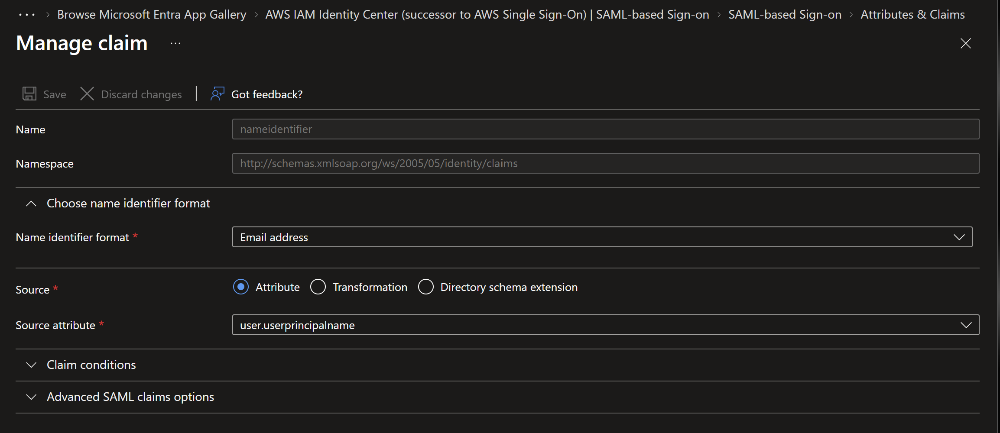
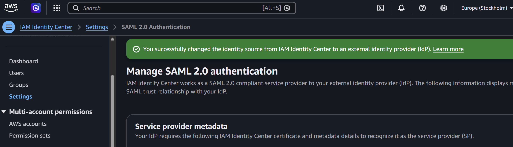
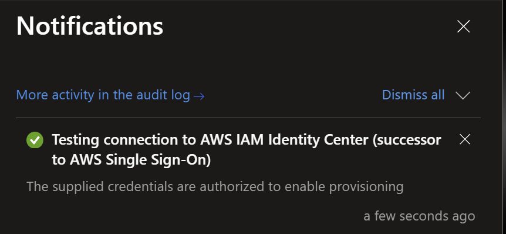
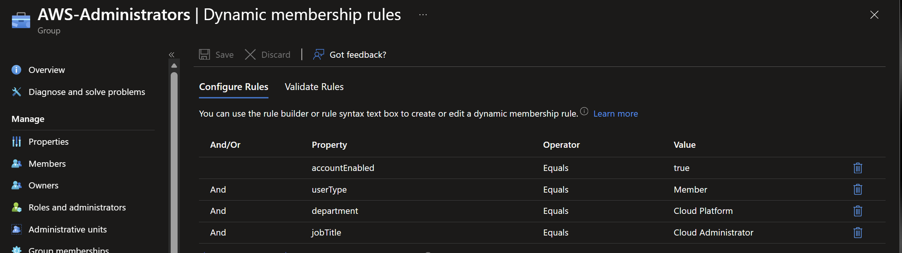

# Entra federation and AWS access

**Date:** 2026-09-01

## Goal

Use Microsoft Entra ID as the workforce identity source for AWS IAM Identity Center.

## Implementation

1. Added the AWS IAM Identity Center gallery application and configured SAML. The Name ID uses the email-address format with `user.userprincipalname` as its source.

   

2. Imported the Entra federation metadata into AWS and changed the IAM Identity Center identity source to the external IdP.

   

3. Enabled SCIM provisioning and verified the connection from Entra. The endpoint and token were not retained in the repository.

   

4. Deployed the `AWS-Administrators` security group through Microsoft Graph Bicep. Membership requires an enabled member account with department `Cloud Platform` and job title `Cloud Administrator`.

   

5. Assigned the dynamic group to the enterprise application and scoped provisioning to assigned identities.

   

6. Provisioned the group and its member to AWS. Created the `CrossCloud-Administrators` permission set with `AdministratorAccess` and a one-hour session.

   

7. Assigned the group and permission set to the AWS account, then verified Entra-authenticated access through the AWS access portal.

8. Configured the `cross-cloud-admin` AWS CLI SSO profile and completed browser authorization for temporary credentials.

   

## Validation

- SAML trust was accepted by AWS IAM Identity Center.
- SCIM created the assigned group and member in AWS.
- The dynamic membership rule selected the expected member account.
- The AWS access portal displayed the assigned account after Entra authentication.
- AWS CLI SSO authorization completed successfully.

## Troubleshooting

The initial SSO test was blocked because the user was not assigned to the enterprise application. Assigning the dynamic group resolved the failure while keeping assignment enforcement enabled.

## Next steps

Implement the synthetic Joiner identity, automatic baseline entitlement, and Joiner Lifecycle Workflow.
