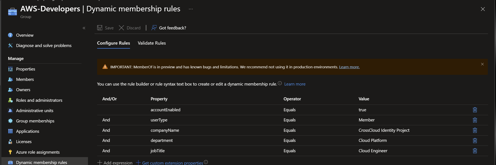
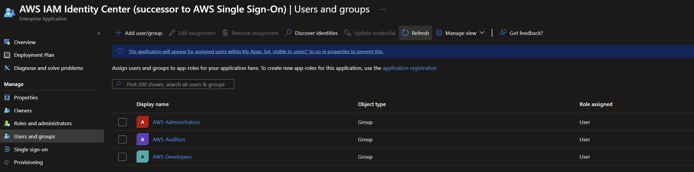
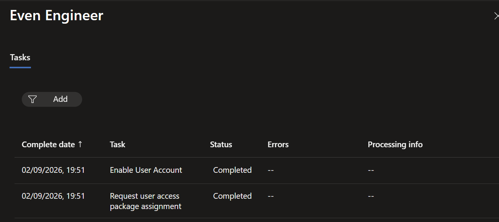
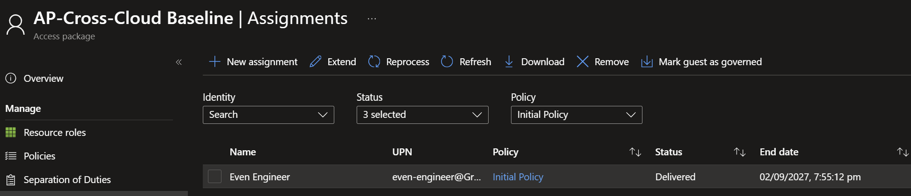

# Phase 2: Identity lifecycle foundation and Joiner

**Date:** 2026-09-02

## Goal

Give a synthetic Joiner baseline Entra access automatically, before any interactive sign-in, and provision it toward AWS IAM Identity Center.

## Implementation

1. Expanded the Microsoft Graph Bicep group deployment beyond `AWS-Administrators` to add `AWS-Developers`, `AWS-Auditors`, and `CrossCloud-Workforce`. Each rule requires an enabled member account with company `CrossCloud Identity Project`; the role groups add a department and job title condition.

   

2. Assigned the three AWS role groups to the IAM Identity Center enterprise application and kept provisioning scoped to assigned identities.

   

3. Created the `AP-Cross-Cloud Baseline` access package in Entitlement Management with a direct-assignment policy and no approval step.

4. Created the Joiner Lifecycle Workflow and ran it on demand for the synthetic user `Even Engineer`. The run enabled the account and requested the baseline access package assignment.

   

5. Confirmed the baseline package assignment reached the delivered state without a user sign-in.

   

## Validation

- The expanded dynamic rules compiled and the four groups deployed through Bicep.
- The AWS role groups appear on the enterprise application assignment list.
- Both Joiner workflow tasks completed with no errors.
- The `AP-Cross-Cloud Baseline` assignment for `Even Engineer` shows status Delivered.

## Troubleshooting

The Joiner workflow ran, but the dynamic developer group skipped the user. The rule matched `user.jobTitle -eq "Cloud Engineer"`, and the stored value was `Cloud  Engineer` with two spaces. Dynamic membership rules compare strings literally and do not normalize whitespace, and the admin center collapses the extra space when it renders the attribute, so the value looked correct. Fixing the attribute resolved the membership. Relaxing the rule to `-contains "Cloud Engineer"` would also have worked, but it would match unintended titles such as `Senior Cloud Engineer`, so the attribute was corrected instead.

## Next steps

Store the Lifecycle Workflow definitions as version-controlled Graph payloads, add the Mover and Leaver personas, and verify SCIM provisioning of the Joiner into IAM Identity Center.
