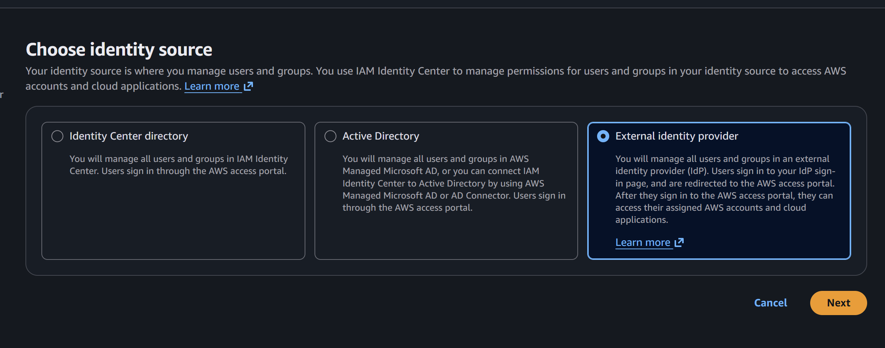
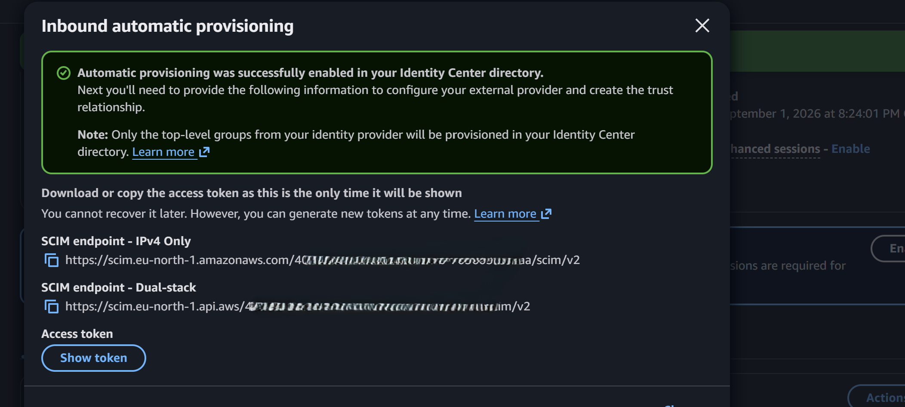
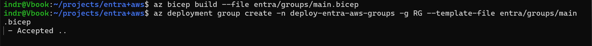
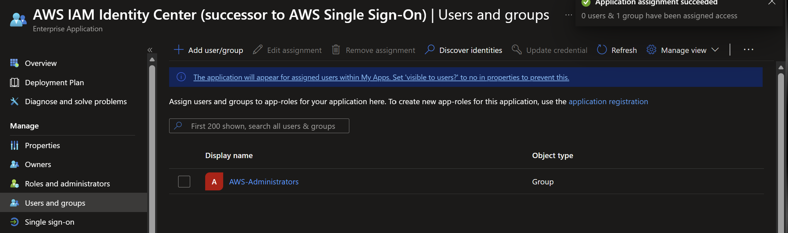
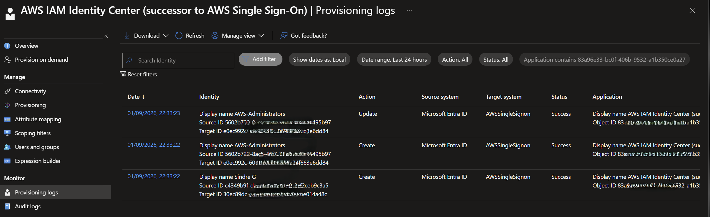
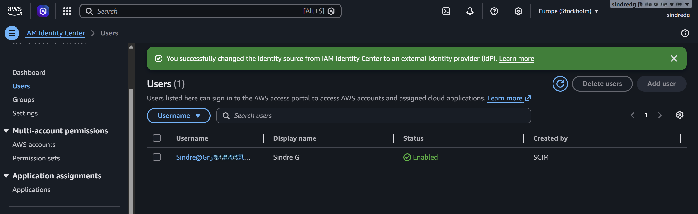
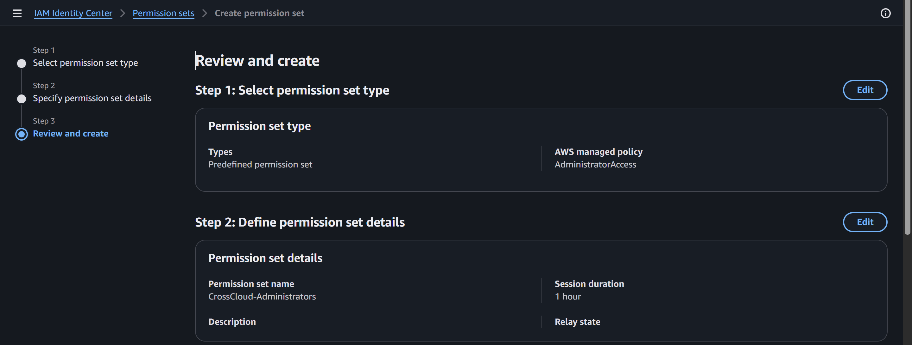
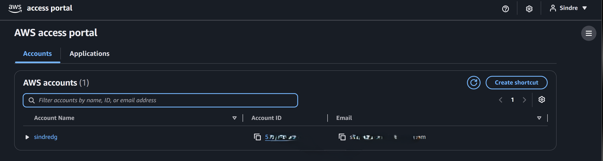
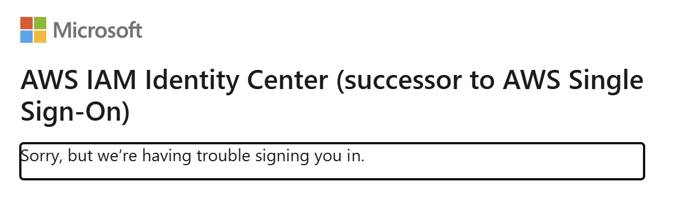

# Phase 1: Entra federation and AWS access

**Date:** 2026-09-01

## Goal

Make Microsoft Entra ID the workforce identity source for AWS IAM Identity Center.

## Implementation

Switched the IAM Identity Center identity source to an external provider.

Added the AWS IAM Identity Center gallery application and set the Name ID to the email-address format, sourced from `user.userprincipalname`. IAM Identity Center matches the SCIM `userName` against this value, so a mismatch here breaks sign-in after provisioning succeeds.

Exchanged metadata in both directions: the AWS service provider metadata into Entra, the Entra federation metadata into AWS.

Enabled automatic provisioning in AWS. The endpoint and token are shown once and were not retained in the repository.

Deployed the `AWS-Administrators` security group through Microsoft Graph Bicep. Membership requires an enabled member account with department `Cloud Platform` and job title `Cloud Administrator`.

Assigned the group to the enterprise application and scoped provisioning to assigned identities only.

## Validation

The provisioning service created the group and its member in AWS, and IAM Identity Center reports both as SCIM-owned.

Created the `CrossCloud-Administrators` permission set with `AdministratorAccess` and a one-hour session, then assigned it to the group on the project account. Phase 3 replaced this permission set with a Terraform-managed one.

The access portal shows the assigned account after Entra authentication, and `aws sso login` completes browser authorization for the `cross-cloud-admin` profile.

## Troubleshooting

The first SSO test failed with `AADSTS50105`. The user authenticated to Entra but was not assigned to the enterprise application, and the application blocks unassigned users by default.

Assigning the dynamic group fixed it. Turning off assignment enforcement would also have cleared the error, but that would let every tenant identity reach the AWS application, so the group assignment was the correct fix.

## Next steps

Implement the synthetic Joiner identity, automatic baseline entitlement, and Joiner Lifecycle Workflow.
