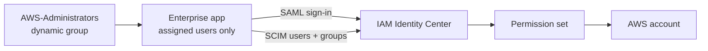

# Phase 1: Entra federation and AWS access

**Date:** 2026-09-01

**Goal:** Make Microsoft Entra ID the workforce identity source for AWS IAM Identity Center.

## Steps

1. Set the IAM Identity Center identity source to an external provider.

   

1. Add the AWS IAM Identity Center gallery app. Set Name ID to email format from `user.userprincipalname`.

   > **Important:** Identity Center matches the SCIM `userName` against Name ID. A mismatch breaks sign-in even when provisioning succeeds.

   

1. Exchange SAML metadata in both directions.

   

1. Enable automatic provisioning in AWS. The SCIM endpoint and token are shown once and aren't stored in the repository.

   

   

1. Deploy `AWS-Administrators` with Graph Bicep. Membership rule: enabled member, department `Cloud Platform`, job title `Cloud Administrator`.

   

   

1. Assign the group to the enterprise app. Scope provisioning to assigned identities.

   

## Validation

SCIM created the group and user in AWS. Identity Center shows both as SCIM-owned.

The `CrossCloud-Administrators` permission set (`AdministratorAccess`, one-hour session) was assigned to the group. Phase 3 replaced it with a Terraform-managed permission set.

The access portal and `aws sso login` both work through Entra.

## Troubleshooting

| Symptom | Cause | Fix |
| --- | --- | --- |
| `AADSTS50105` on first sign-in | User not assigned to the enterprise app | Assign the dynamic group |

Turning off assignment enforcement also clears the error, but it lets every tenant identity reach AWS.
