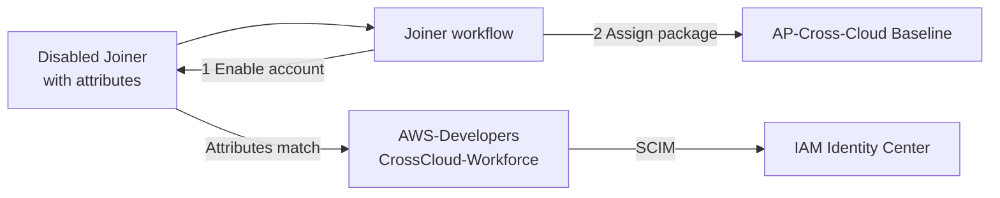

# Phase 2: Identity lifecycle foundation and Joiner

**Date:** 2026-09-02

**Goal:** Give a synthetic Joiner baseline access automatically, before first sign-in, and provision the Joiner into IAM Identity Center.

> **Note:** [Phase 7](phase-7-jml-lifecycle.md) reruns the Joiner with version 2, which requests the package before it enables the account.

## Steps

1. Add `AWS-Developers`, `AWS-Auditors`, and `CrossCloud-Workforce` to the Graph Bicep deployment. Every rule requires an enabled member with company `CrossCloud Identity Project`. Role groups also match department and job title.

   

   > **Note:** What-if can't evaluate `dynamicGroup`. Read the rules back from the portal after each deployment.

   

   

   

1. Create the Joiner with company, department, job title, employee ID, hire date, and manager. The account starts disabled.

   

1. Assign the three AWS role groups to the Identity Center enterprise app.

   

1. Create the `Cross-Cloud Identity` catalog and the `AP-Cross-Cloud Baseline` package with a direct-assignment policy and no approval.

   

1. Create the Joiner workflow and run it on demand.

   

## Validation

The run processed one user. Both tasks succeeded.

The baseline package was delivered without a user sign-in.

Dynamic membership added the user to `AWS-Developers` and `CrossCloud-Workforce`.

SCIM created the user and role groups in Identity Center.

## Troubleshooting

| Symptom | Cause | Fix |
| --- | --- | --- |
| Joiner missing from `AWS-Developers` | Job title stored as `Cloud  Engineer` (two spaces). Rules compare literally, and the portal hides the extra space. | Correct the attribute |

Changing the rule to `-contains "Cloud Engineer"` also works, but it matches titles like `Senior Cloud Engineer`.
