# Phase 2: Identity lifecycle foundation and Joiner

**Date:** 2026-09-02

## Goal

Give a synthetic Joiner baseline Entra access automatically, before any interactive sign-in, and provision it into AWS IAM Identity Center.

## Implementation

Expanded the Graph Bicep group deployment beyond `AWS-Administrators` to add `AWS-Developers`, `AWS-Auditors`, and `CrossCloud-Workforce`. Every rule requires an enabled member account with company `CrossCloud Identity Project`; the three role groups add a department and job title condition on top of that.

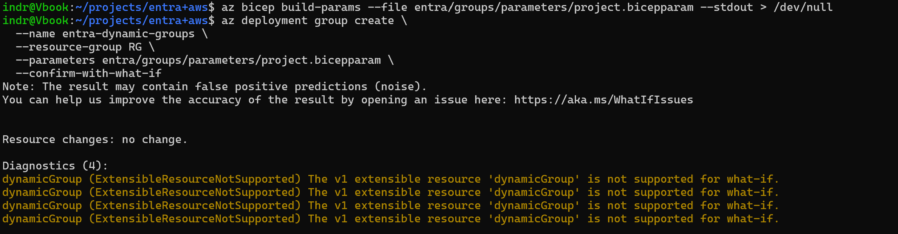

The what-if preview cannot evaluate `dynamicGroup`, which is a v1 extensible resource. The deployment is still idempotent, but the plan step gives no coverage here, so the rules were read back from the portal after each apply.

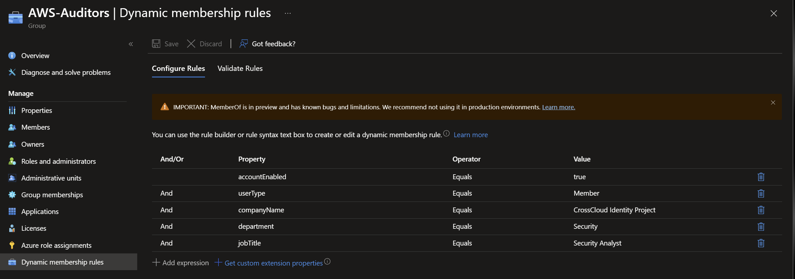

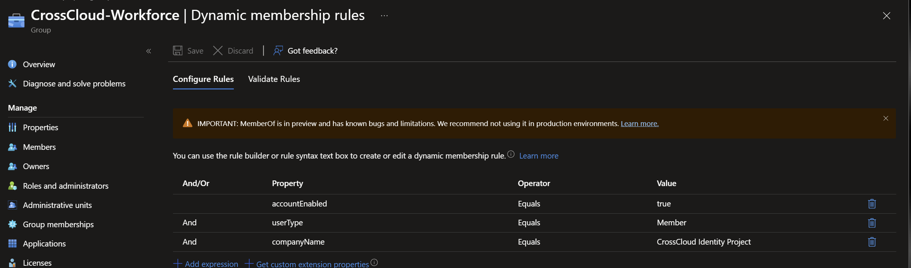

Created the synthetic Joiner with the attributes the lifecycle depends on: company, department, job title, employee ID, hire date, and manager. The account starts disabled, so the workflow has something to enable.

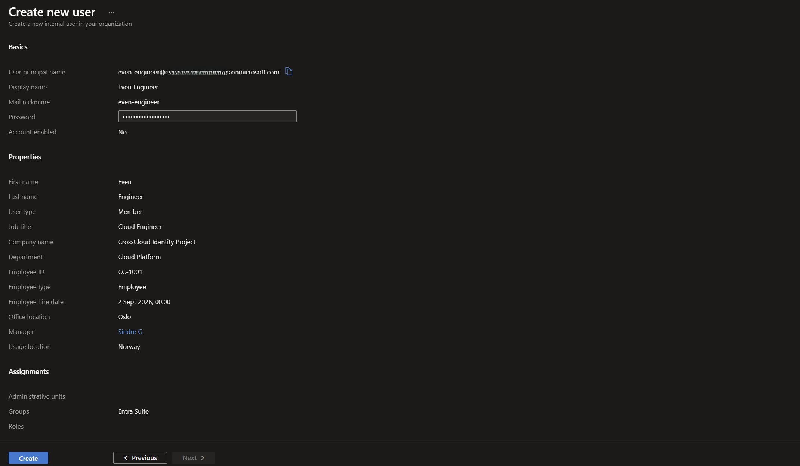

Assigned the three AWS role groups to the IAM Identity Center enterprise application, keeping provisioning scoped to assigned identities.

Created the `Cross-Cloud Identity` catalog and the `AP-Cross-Cloud Baseline` access package with a direct-assignment policy and no approval step.

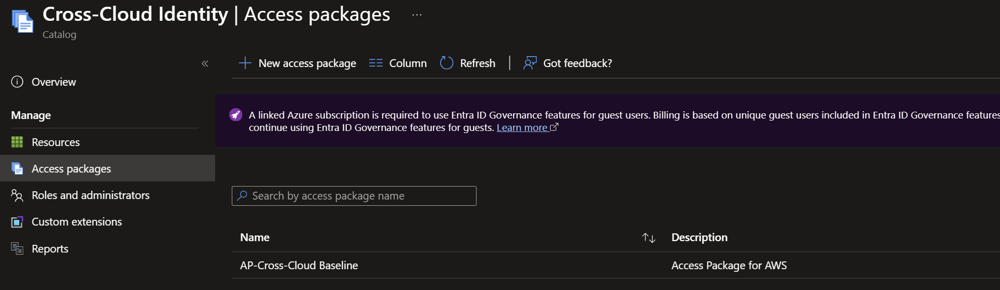

Created the Joiner workflow with two tasks and ran it on demand.

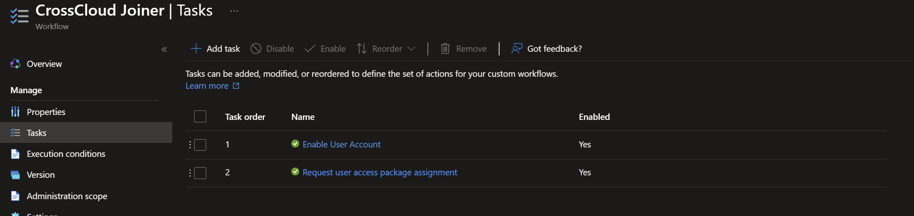

## Validation

The run processed one user with no failed tasks, and both tasks completed.

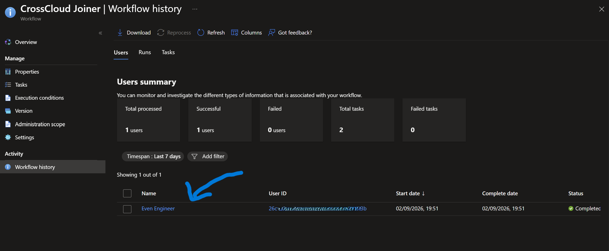

The baseline package reached the delivered state without a user sign-in.

Dynamic membership then placed the user in `AWS-Developers` and `CrossCloud-Workforce`.

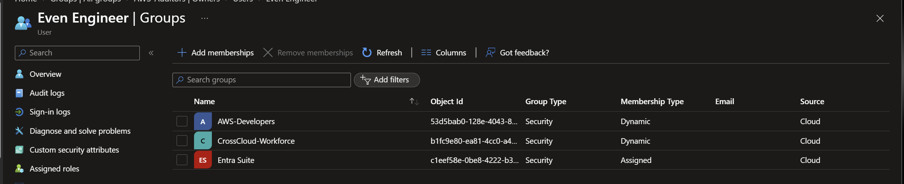

The provisioning service created the user and the role groups in AWS, and IAM Identity Center shows both as SCIM-owned.

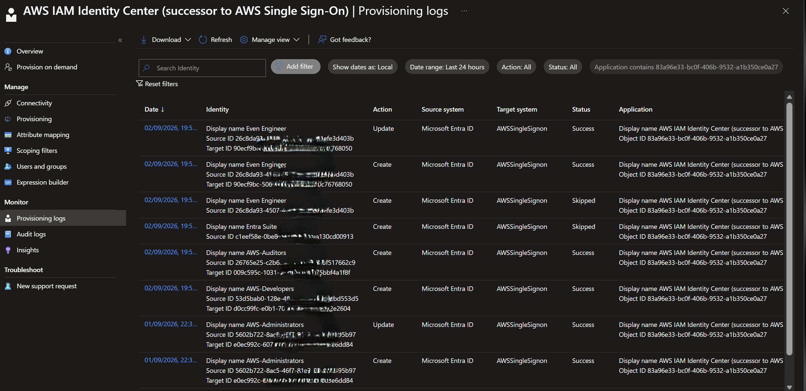

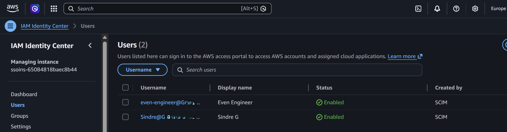

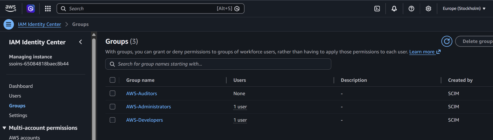

## Troubleshooting

The workflow ran cleanly, but the dynamic developer group skipped the user. The rule matched `user.jobTitle -eq "Cloud Engineer"` and the stored value was `Cloud  Engineer` with two spaces. Dynamic membership rules compare strings literally and do not normalize whitespace, and the admin center collapses the extra space when it renders the attribute, so the value looked correct in every view. Correcting the attribute resolved the membership.

Relaxing the rule to `-contains "Cloud Engineer"` would also have worked, but it would match unintended titles such as `Senior Cloud Engineer`, so the attribute was fixed instead of the rule.
