# Phase 2: Lifecycle Workflows as version-controlled Graph JSON

**Date:** 2026-09-03

**Historical tooling:** The helpers and unvalidated Mover/Leaver templates described below were retired on 2026-09-10. The observations remain unchanged; these are no longer current deployment instructions. See the [reference and rebuild scope](../entra/lifecycle-workflows/README.md) and [ADR-023](../decisions.md#adr-023-build-an-aws-operations-lab-with-governed-workforce-access).

## Goal

Deploy the Joiner, Mover, and Leaver workflows from files in this repository instead of the portal, without committing a single tenant object ID.

## Why not Bicep

Microsoft Graph Bicep supports only `applications`, `appRoleAssignedTo`, `federatedIdentityCredentials`, `groups`, `oauth2PermissionGrants`, `servicePrincipals`, and `users`. Lifecycle Workflows are not in that list, so the pattern used for the dynamic groups does not extend to them. The definitions go to the Graph REST API as JSON instead, under [`entra/lifecycle-workflows/`](../entra/lifecycle-workflows/).

## Implementation

Installed the prerequisite left over from Phase 0 and connected with the three delegated scopes the scripts need.

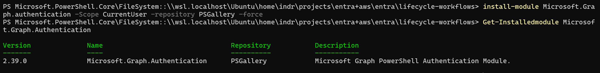

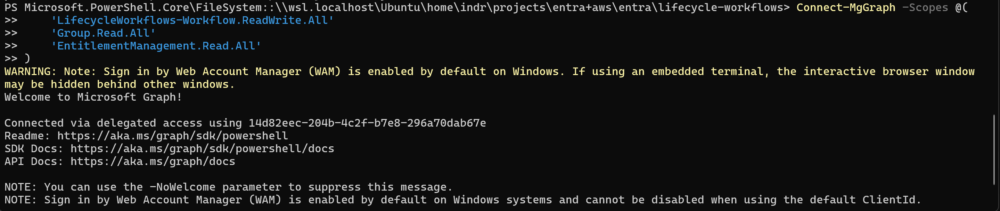

Committed definitions carry `<PLACEHOLDER>` tokens for every tenant-specific display name, and `${group:...}`, `${accessPackage:...}`, and `${accessPackagePolicy:...}` markers for the object IDs that task arguments require. `deploy.ps1` refuses any file that still contains a `<PLACEHOLDER>`, so the templates cannot be deployed by accident; a real deployment copies them to the Git-ignored `local/` directory and fills in the names. Object IDs resolve at deployment time and fail loudly when a name matches no object or more than one.

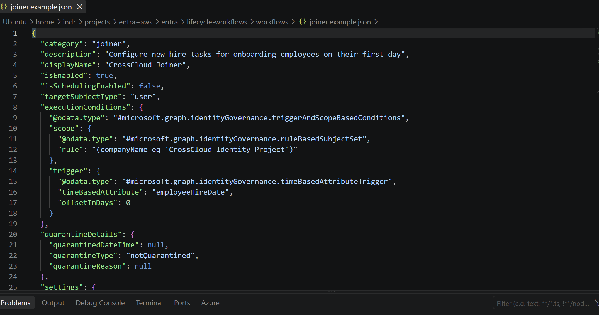

The deploy script compares the tenant against the file and picks one of four paths. This split is forced by the API: `PATCH` accepts only `displayName`, `description`, `isEnabled`, and `isSchedulingEnabled`, so any change to `tasks` or `executionConditions` needs `POST .../createNewVersion`.

| Situation | Action |
| --- | --- |
| No workflow with that display name | `POST` creates it |
| Only the four patchable properties differ | `PATCH` updates in place |
| `tasks` or `executionConditions` differ | `createNewVersion` publishes a new version |
| Nothing differs | No write call |

Running the Joiner definition against the workflow that Phase 2 validated produces no write call, which is what closes the reconciliation between the portal and the repository.

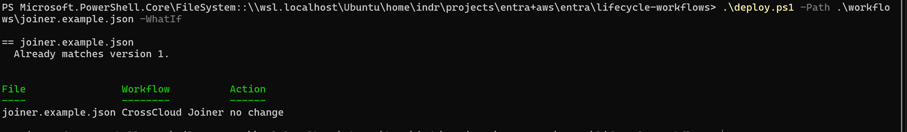

Every definition sets `isSchedulingEnabled` to `false`, so nothing fires on its own. `-WhatIf` makes no write calls at all.

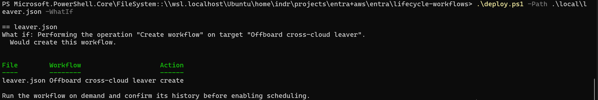

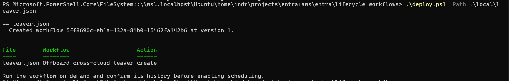

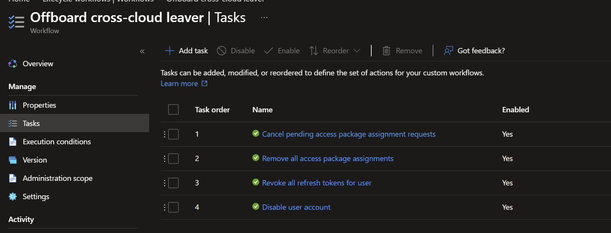

## Validation

All three workflows exist in the tenant, deployed from files, with scheduling off and no object IDs in the committed definitions.

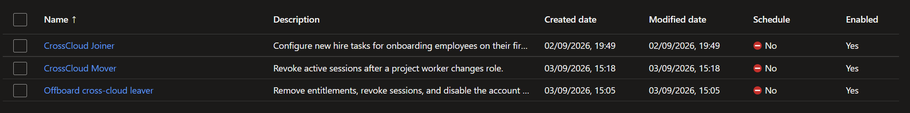

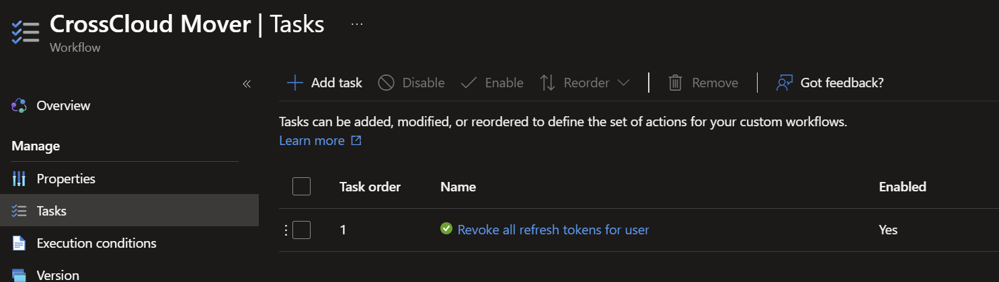

## Troubleshooting

The Mover was designed to trigger on a change to either `jobTitle` or `department`. Graph rejected the create with `400 BAD_REQUEST: Multiple trigger attributes are not allowed`.

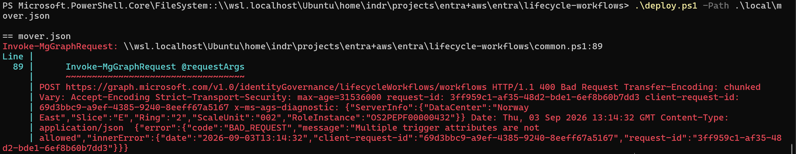

An `attributeChangeTrigger` accepts exactly one attribute. The definition now triggers on `jobTitle` alone, which is the attribute the dynamic role groups key on, so a department change without a title change is not a role change in this project's model. Covering both would take two workflows.

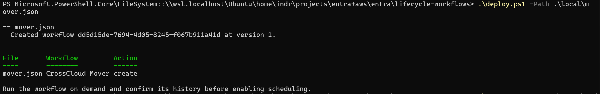

The deployed Mover also carries only the token revocation task. Its access package swap needs a second package that does not exist yet, so those tasks stay in the committed definition and go in when Phase 7 creates the elevated package.
