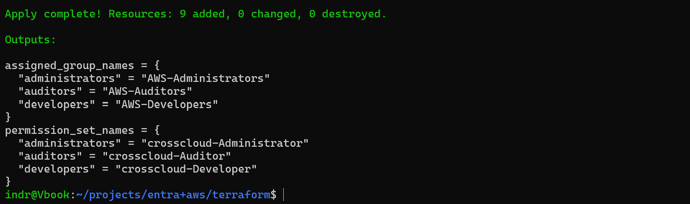

# Phase 3: Terraform AWS foundation and permission sets

**Date:** 2026-09-02

## Goal

Manage IAM Identity Center permission sets and their account assignments with Terraform, while SCIM keeps ownership of the groups and their members.

## Implementation

1. Added the root Terraform configuration with pinned versions (`terraform ~> 1.15.0`, `aws ~> 6.60.0`), validated variables for region, name prefix, and environment, and a provider that uses the `cross-cloud-admin` SSO profile.

2. Added an `identity_center` module that creates one permission set per role, attaches an AWS managed policy to each, looks up the SCIM-provisioned group by display name, and assigns the group and permission set to the current account.

3. Configured three roles: `crosscloud-Administrator` (`AdministratorAccess`, one-hour session), `crosscloud-Developer` (`PowerUserAccess`, four-hour session), and `crosscloud-Auditor` (`SecurityAudit`, four-hour session).

4. Ran `terraform apply` with temporary SSO credentials.

   

5. Confirmed the group-to-permission-set assignments in the AWS console.

   

## Validation

- `terraform apply` added nine resources with no changes or deletions.
- The `assigned_group_names` and `permission_set_names` outputs list the three roles.
- The AWS account shows `AWS-Administrators`, `AWS-Developers`, and `AWS-Auditors` mapped to their permission sets.
- The group lookups resolved without Terraform creating or mutating any user or group membership.

## Next steps

Retire the unmanaged bootstrap permission set from Phase 1 once the Terraform-managed administrator path is confirmed, and add compact outputs for later phases.
