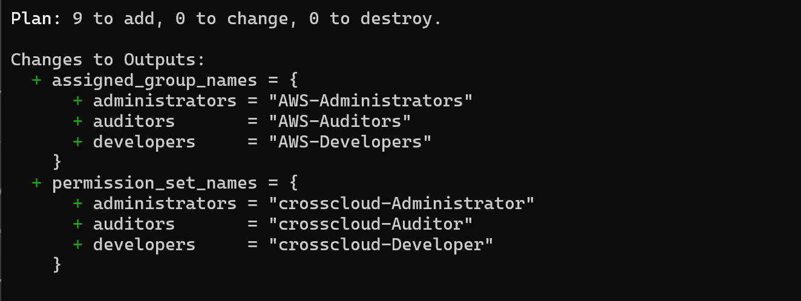
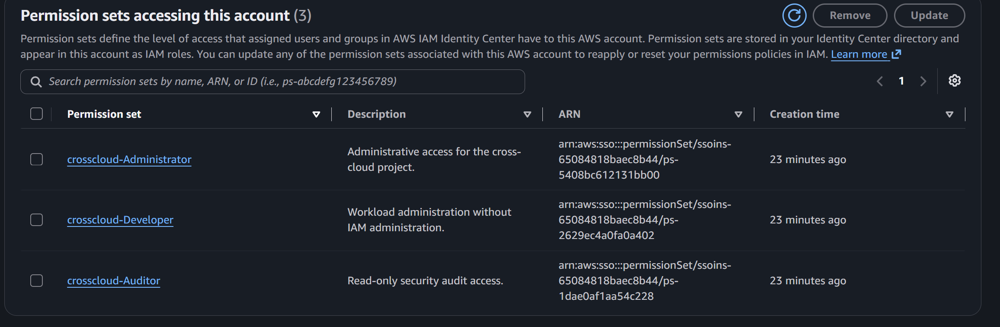
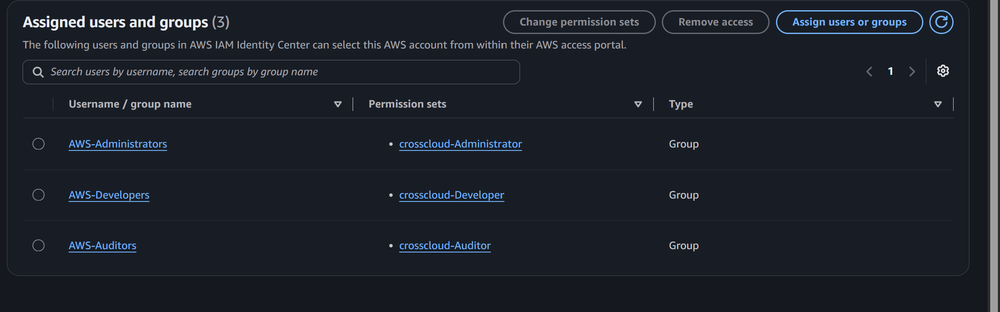
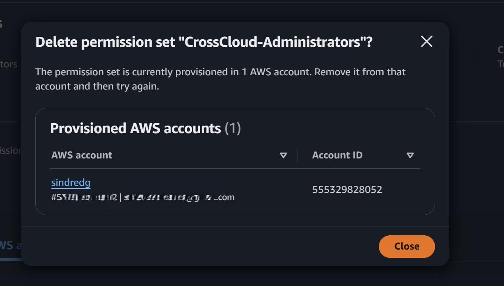

# Phase 3: Terraform AWS foundation and permission sets

**Date:** 2026-09-02

## Goal

Put IAM Identity Center permission sets and their account assignments under Terraform, while SCIM keeps ownership of the groups and their members.

## Implementation

Added the root configuration with pinned versions (`terraform ~> 1.15.0`, `aws ~> 6.60.0`), validated variables for region, name prefix, and environment, and a provider that uses the `cross-cloud-admin` SSO profile.

An `identity_center` module creates one permission set per role, attaches an AWS managed policy to each, looks the SCIM-provisioned group up by display name, and assigns the pair to the current account:

| Permission set | Policy | Session |
| --- | --- | --- |
| `crosscloud-Administrator` | `AdministratorAccess` | 1 hour |
| `crosscloud-Developer` | `PowerUserAccess` | 4 hours |
| `crosscloud-Auditor` | `SecurityAudit` | 4 hours |

The group lookup is a data source, never a resource. Terraform reads the groups SCIM created and never writes to them.

## Validation

The account shows the three permission sets and the three groups mapped to them.

## Troubleshooting

Removing the Phase 1 bootstrap permission set failed while it was still provisioned to the account.

Order matters: remove the permission set's access from the account first, then delete the permission set. The new Terraform-managed administrator path was validated before either step, so the account was never without an administrative route.

## Plan reconciliation

Closing this phase exposed Phase 0 items that were never blocking work in progress. Each one now sits where it is actually needed:

| Item | Outcome |
| --- | --- |
| AWS Budget and cost anomaly alerts | Removed. The footprint is small and time-boxed, and Terraform gates it behind a single flag. |
| Bootstrap permission set | Removed from AWS. The Terraform-managed administrator path is the only administrative route. |
| DNS domain, certificate path, public host names | Dropped. ADR-016 removed the public applications that needed them. |
| Windows 11 device and Global Secure Access client | Moved to Phase 5, which registers the connector and publishes the application. |
| PowerShell 7, Microsoft Graph modules, `jq` | Moved to Phase 2, which needs them for Lifecycle Workflow payloads. |
| Fargate CPU architecture decision | Moved to Phase 6, which builds the first image. |
| CIDR and feature-flag variables | Moved to Phase 4, which introduces the network. |
| `scripts/check-prereqs.sh` | Reference removed. The script belongs to an unrelated repository and was never committed here. |
