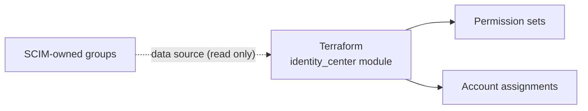

# Phase 3: Terraform permission sets

**Date:** 2026-09-02

**Goal:** Manage IAM Identity Center permission sets and account assignments with Terraform. SCIM keeps ownership of groups and members.

## Implementation

- Pinned `terraform ~> 1.15.0` and `aws ~> 6.60.0`.
- Validated variables for region, name prefix, and environment.
- Provider uses the `cross-cloud-admin` SSO profile.
- The `identity_center` module reads each SCIM group as a data source and never writes to it.

| Permission set | Policy | Session |
| --- | --- | --- |
| `crosscloud-Administrator` | `AdministratorAccess` | 1 hour |
| `crosscloud-Developer` | `PowerUserAccess` | 4 hours |
| `crosscloud-Auditor` | `SecurityAudit` | 4 hours |

## Validation

## Troubleshooting

| Symptom | Cause | Fix |
| --- | --- | --- |
| Can't delete the Phase 1 permission set | Still provisioned to the account | Remove its account access first, then delete it |

The Terraform administrator path was validated first, so the account always had an administrative route.

## Plan cleanup

| Phase 0 item | Outcome |
| --- | --- |
| Budget and anomaly alerts | Removed; small, time-boxed footprint |
| Bootstrap permission set | Removed; Terraform administrator is the only route |
| Domain, certificate, public host names | Dropped with the public apps ([ADR-016](../decisions.md#adr-016-focus-on-lifecycle-and-private-access)) |
| PowerShell 7, Graph modules, `jq` | Moved to Phase 2 |
| Test client, CIDRs, CPU architecture | Moved to Phases 4 and 5 |
