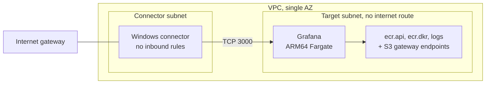

# Phase 4: Minimal AWS network and private target

**Date:** 2026-09-04

**Goal:** Deploy a private target and a connector host. Prove that only the connector can reach the target.

## Design

- One Grafana OSS task pulls its image through interface endpoints. See [ADR-019](../decisions.md#adr-019-run-the-private-target-on-arm-fargate-behind-interface-endpoints) and [ADR-020](../decisions.md#adr-020-reuse-grafana-as-an-anonymous-private-target).
- The connector key pair is created outside Terraform, so no private key enters state. Create it before the first apply.

## Build the image

The target can't reach Docker Hub, so the pinned image is mirrored to ECR. The workstation and task are both ARM64.

| Symptom | Cause | Fix |
| --- | --- | --- |
| `docker login` fails: "The stub received bad data" | Docker config names the Windows `desktop.exe` helper, but the engine is native Linux | Use a temporary `DOCKER_CONFIG` for login and delete it on exit |

## Validation

The connector is running and the ECS service is steady.

The connector security group has no inbound rules. Outbound rules:

| Port | Destination |
| --- | --- |
| 80, 443 | Microsoft endpoints and CRLs |
| 3000 | Target security group |
| 53 | VPC resolver |
| 123 | Time |
| 1688 | Windows activation |

Only the connector route table reaches the internet gateway. The third route table is the unused VPC default.

An HTTP request from the connector to the task returned 200. This confirms the VPC route, both security group rules, and Grafana listening on 3000.

## Limits

- The request crossed the VPC directly. It didn't use Global Secure Access.
- `Invoke-WebRequest` follows redirects, so 200 alone doesn't prove anonymous access. Phase 5 confirms it in the browser.
- Fargate assigns a new IP when a task is replaced (`10.20.1.65` became `10.20.1.63`). Check the IP before you create the application segment.
