# Phase 4: Minimal AWS network and private target

**Date:** 2026-09-04

## Goal

Deploy the private application target and the connector host, and prove the target is reachable from the connector and from nowhere else.

## Design

One VPC, two subnets in a single availability zone. The connector subnet routes to an internet gateway; the target subnet has a route table carrying nothing but the VPC-local route and the S3 gateway endpoint. Grafana OSS runs as one ARM64 Fargate task, pulling its image through `ecr.api`, `ecr.dkr`, and `logs` interface endpoints, so the target tier has no internet path at all. See ADR-019 and ADR-020.

Terraform owns the whole footprint behind an `enable_private_access` flag, so a test window ends by setting it to `false` and applying.

The connector's EC2 key pair is created outside Terraform, so no private key material enters state. A key pair can only be attached at launch, so this has to happen before the first apply.

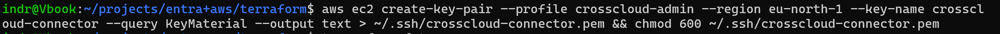

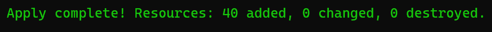

## Building the image

The target subnet cannot reach Docker Hub, so the pinned `grafana/grafana-oss` image is mirrored into the project ECR repository. The workstation is ARM64 and the task runs on ARM Fargate, so this is a native build.

The first push attempt failed in the Docker credential helper rather than in AWS.

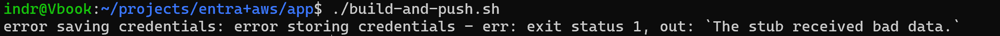

The Docker config still named Docker Desktop's Windows helper, `desktop.exe`, while the active context was the native engine on `unix:///var/run/docker.sock`. The helper cannot run in that path. Pointing `DOCKER_CONFIG` at a throwaway directory for the login avoids the helper entirely, and deleting that directory on exit keeps the short-lived ECR token off the filesystem. The global Docker config is left alone, so the other registries configured there keep working.

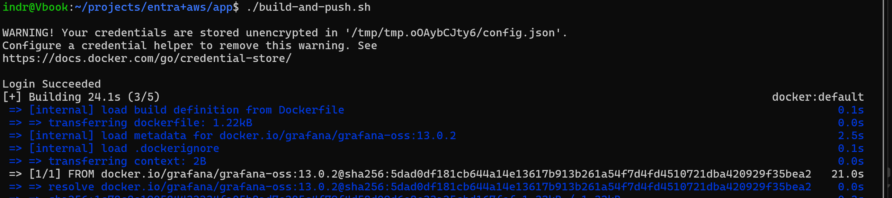

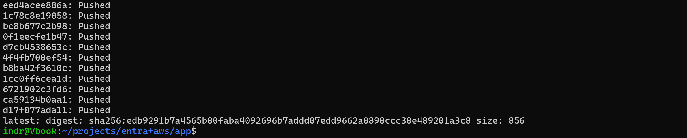

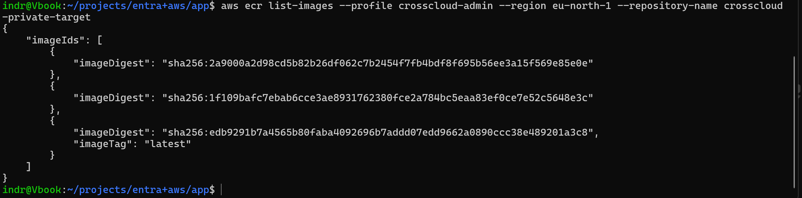

## Validation

The connector host is running with its status checks passed.

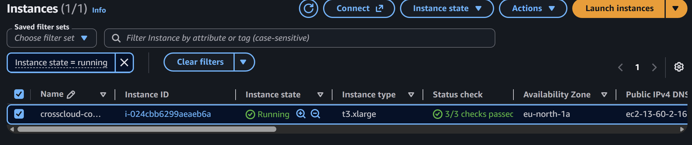

The ECS service placed its task once the image existed and reached a steady state.

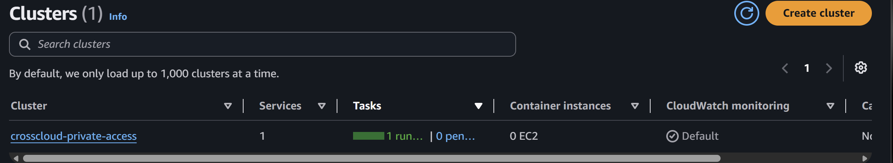

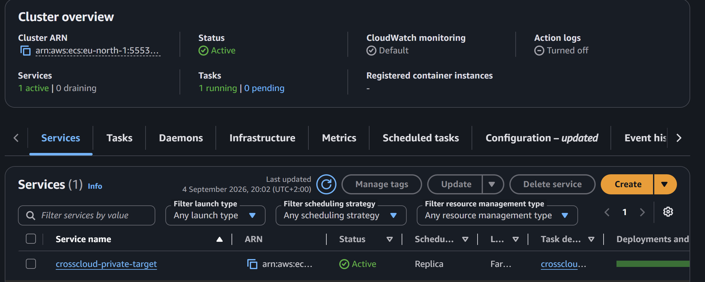

The connector's security group has no inbound rules at all. Its outbound rules are the specific ones the connector and the target path need: 80 and 443 for Microsoft's endpoints and certificate revocation lists, 3000 to the target's security group, 53 to the VPC resolver, 123 for time, and 1688 to the two link-local Windows activation addresses.

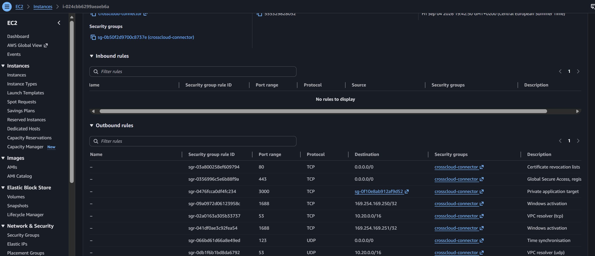

The VPC resource map shows the isolation as a routing fact. The `crosscloud-connector` route table connects to the internet gateway; the `crosscloud-target` route table connects only to the S3 gateway endpoint. There is no path from the target subnet to the gateway.

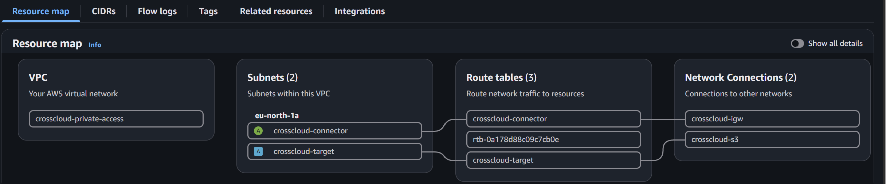

The third route table is the VPC's default main route table. AWS creates it with any VPC and Terraform does not manage it. Both subnets are explicitly associated with the named tables, so nothing routes through it.

Finally, an HTTP request from the connector to the task returned 200.

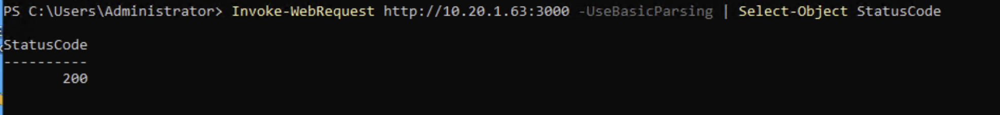

That single response depends on the VPC-local route between the two subnets, the connector's egress rule to the target's security group, the target's ingress rule from the connector's security group, and Grafana actually listening on 3000. Both security group rules reference security groups rather than address ranges, so it also confirms that resolution works. It satisfies Microsoft's prerequisite that the connector server can reach the backend resource before the connector is installed.

## Limits of this evidence

The request travelled directly across the VPC. Nothing here involves Global Secure Access, which is Phase 5.

A 200 does not by itself confirm anonymous access, because `Invoke-WebRequest` follows redirects: a bounce to a Grafana login page would also end at 200. Phase 5 settles it visually when the page is opened through the client.

## Known wrinkle

The application segment has to be published as the task's private address, and Fargate assigns a new address whenever ECS replaces the task. The address moved from `10.20.1.65` to `10.20.1.63` during this phase for that reason. Read it fresh when creating the segment, and re-check it after any task restart.

If this becomes disruptive, the fix is a stable name instead of an address: ECS Service Connect or Cloud Map with a private hosted zone, then an FQDN application segment. The connector resolves it through the VPC resolver. ADR-019 deferred the FQDN path to keep DNS out of the first reachability test; this is the reason that would justify taking it up.
