# Phase 5: Entra Private Access and governed assignment

**Date:** 2026-09-05

## Goal

Reach Grafana at `10.20.1.63:3000`, a private address inside the AWS VPC, from a client device through Microsoft Entra Private Access. No VPN, no peering, no inbound port.

## Result

Working. `HTTP/1.1 200 OK`, 49,401 bytes, rendered in the browser.

The client was an Entra-joined Windows 11 VM in Azure at `172.16.0.4`. Azure and AWS have no network path between them, so the tunnel is the only route by which that request could have succeeded. That is the strongest single piece of evidence in this phase.

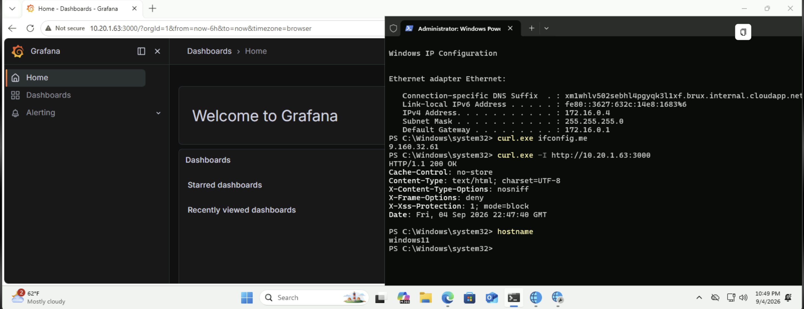

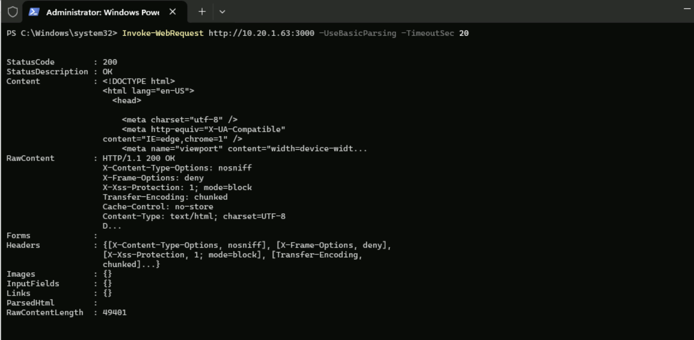

## How the traffic reaches an isolated subnet

Neither end of this path is reachable from the other. The Azure VM has no route to `10.20.0.0/16`, and the AWS target subnet has a route table carrying nothing but the VPC-local route and an S3 gateway endpoint. The connector opens the only channel, and it opens it outbound.

```mermaid
flowchart LR
    subgraph Azure["Azure"]
        Client["Windows 11 VM<br/>172.16.0.4<br/>Entra joined, GSA client"]
    end

    subgraph Entra["Microsoft Entra"]
        Edge["Global Secure Access edge<br/>Evaluates app assignment<br/>and Conditional Access"]
        PA["Private Access service"]
    end

    subgraph VPC["AWS VPC 10.20.0.0/16, eu-north-1"]
        subgraph Routed["Routed subnet"]
            Connector["Private network connector<br/>10.20.0.155<br/>No inbound rule"]
        end
        subgraph Isolated["Isolated subnet, no internet route"]
            Target["Grafana on Fargate<br/>10.20.1.63:3000<br/>No public address"]
        end
    end

    Client -->|"1 Client intercepts 10.20.1.63:3000<br/>at the socket layer, not by routing"| Edge
    Edge -->|"2 Authorised, token issued for the app"| PA
    Connector -.->|"3 Connector dials out and holds<br/>the tunnel open"| PA
    PA -->|"4 Session brokered onto<br/>the existing tunnel"| Connector
    Connector -->|"5 TCP 3000, allowed only from<br/>the connector security group"| Target
```

Nothing listens for the client. The connector is reachable on no inbound port, the target has no public address, and there is no peering or VPN between the two clouds. Authorisation happens at step 2, before any packet approaches AWS, which is what makes this an identity boundary rather than a network one.


## Configuration

Connector group `aws-access`, holding the single connector on the AWS host, region Europe.

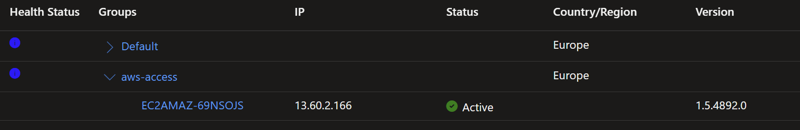

Global Secure Access enterprise application `Grafana-AWS`, bound to that connector group, publishing one IP segment rather than a network range.

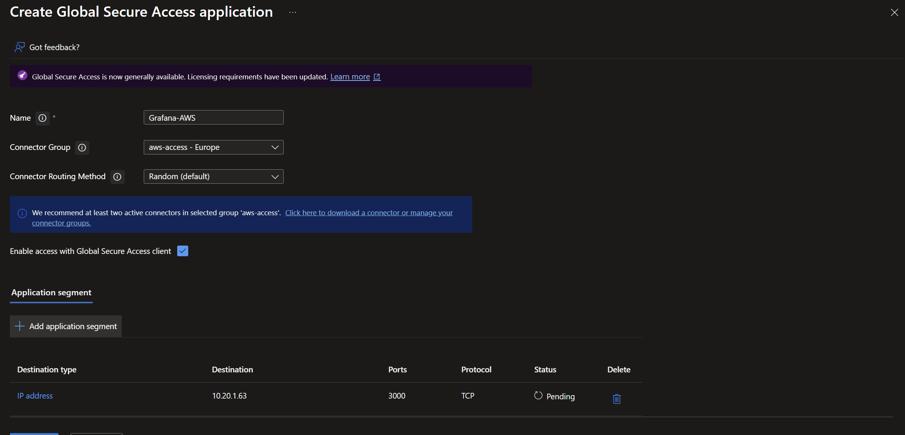

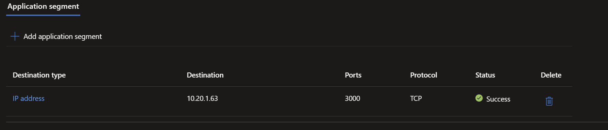

Access is granted through the same SCIM-provisioned groups that carry AWS permission sets, so one group membership drives both the AWS role and the private application.

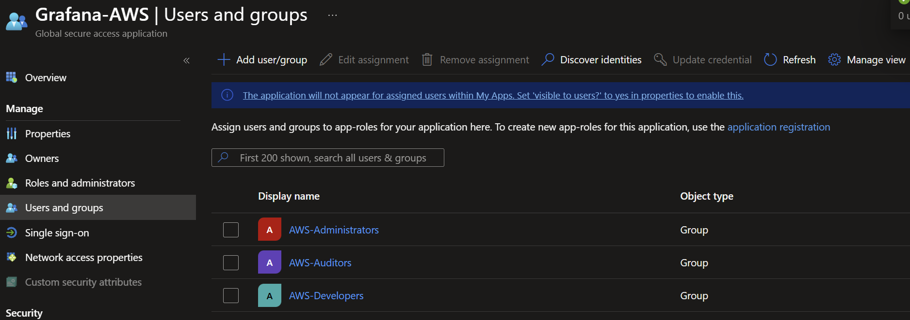

The Private access traffic forwarding profile was enabled and assigned. The client then received a tunnel rule for the segment.

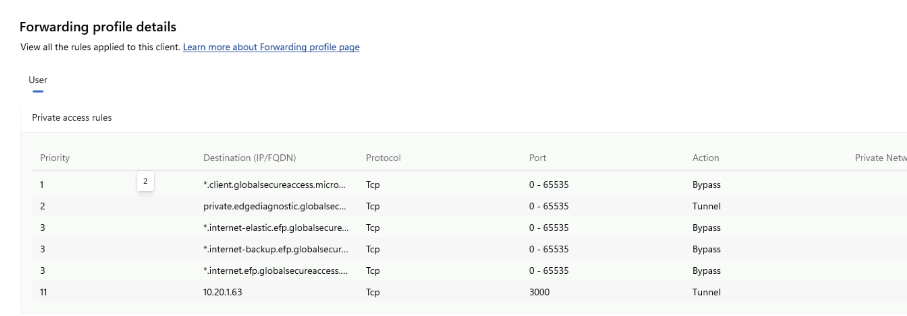

## Troubleshooting

The tenant was configured correctly throughout. Every layer passed on first inspection: licensing, the app, the segment, the connector group, group assignment, and Conditional Access. The blocker was entirely client-side identity.

The original test laptop is Windows 11 Home on ARM64, signed into Windows with a personal Microsoft account and only Entra registered. The Global Secure Access client sat at `Signed out` with no account, device ID or join type.

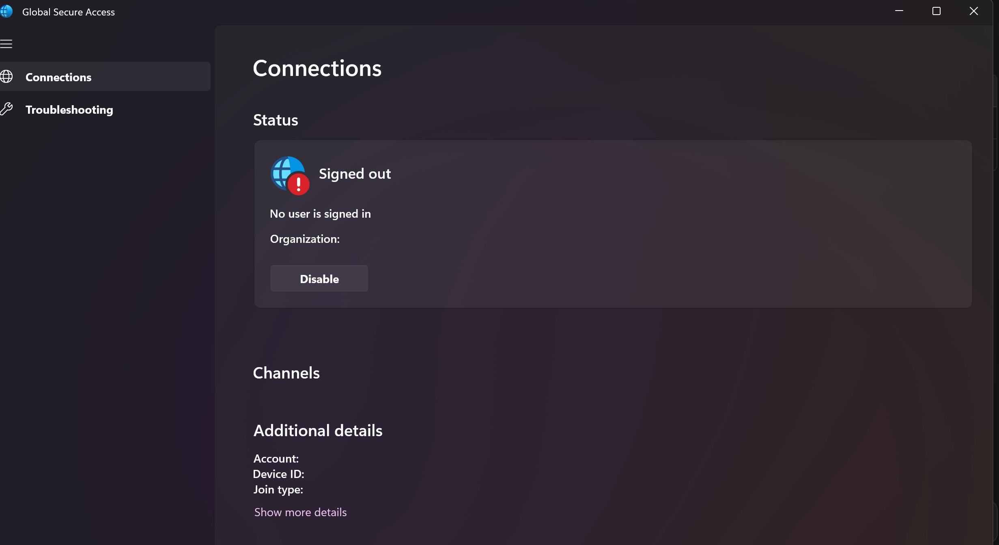

The client surfaces this as a generic token failure, logged as Event 421 in `Microsoft-Windows-Global Secure Access Client-Operational` and repeating every 60 seconds. The real error is only visible in `Microsoft-Windows-AAD/Operational`:

```text
AADSTS9002341: User is required to permit SSO   (interaction_required)
```

That combination cannot obtain a Primary Refresh Token, so no user token, so no forwarding profile, so no tunnel. Windows 11 Home cannot be Entra joined at all, since join requires Pro, Enterprise or Education. The laptop was unfixable by configuration.

The portal states the requirement plainly, and it applies to both the x64 and Arm64 clients.

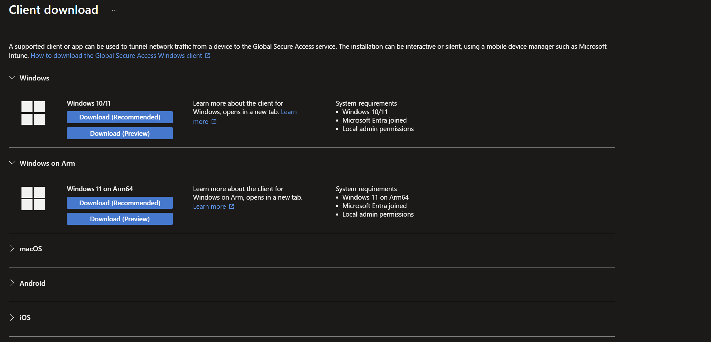

Replacing the client with an Entra-joined Windows 11 VM in Azure resolved it. Join yields a real PRT at Windows sign-in, silent token acquisition succeeded immediately, and nothing else needed changing.

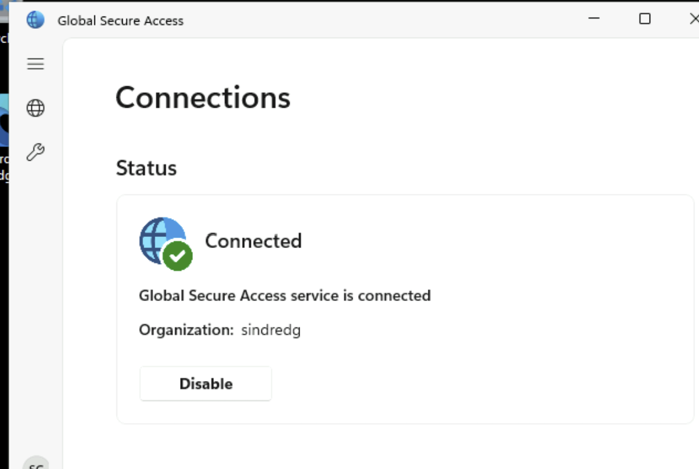

See ADR-021.

## Notes for next time

Roughly two hours were lost to a wrong tenant. The Azure CLI defaulted to an unrelated directory, and a full Graph audit there returned convincing but meaningless "everything is missing" results. `dsregcmd /status` gives the authoritative tenant ID under `WorkplaceTenantId`. A tenant rename does not change its GUID, and a similarly named user existed in the other directory.

Graph does not populate `applicationSegments` on the parent `onPremisesPublishing` object. Read them from `/applications/{id}/onPremisesPublishing/segmentsConfiguration/microsoft.graph.ipSegmentConfiguration/applicationSegments` or they always appear empty. `$expand=connectorGroup` is rejected on the `/applications` collection and only works on a single application.

`Test-NetConnection` is misleading here. Private Access tunnels TCP and UDP but never ICMP, and it intercepts at the socket layer rather than through the routing table, so `route print` shows no route to the target and a ping always fails. Neither is a fault. Use a real HTTP request.

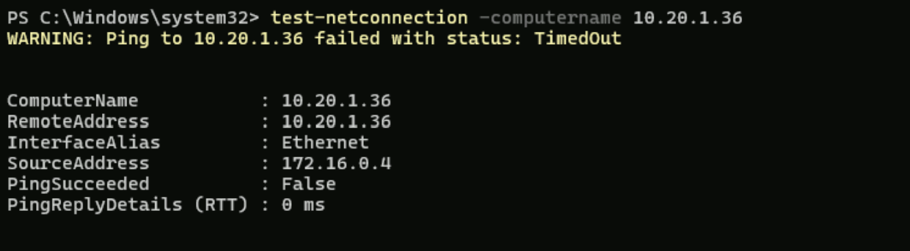

Edge silently upgrades a typed `IP:port` to HTTPS, which breaks a plain HTTP backend. Type the `http://` prefix explicitly.

On the Entra join dialog, the small "Join this device to Microsoft Entra ID" link performs the join. Typing an address into the main box performs a workplace join, which leaves the device registered and is the state that does not work.

## Not completed

The exit criteria are half met. An assigned identity reaches the target. The denial case for an unassigned identity was not run, and without it this phase demonstrates reachability rather than a boundary.

Also outstanding: the pilot was the administrator account rather than the synthetic Joiner from Phase 2, so the lifecycle link is asserted by the group assignment rather than demonstrated, and no access package was created, so assignment is direct rather than governed.

The AWS footprint was destroyed after this test, so finishing these requires redeploying and republishing the segment against a new task address.
