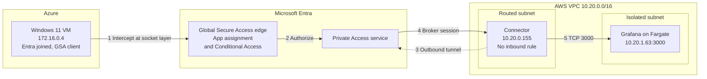

# Phase 5: Entra Private Access and governed assignment

**Date:** 2026-09-05

**Goal:** Reach Grafana at `10.20.1.63:3000` inside the AWS VPC through Microsoft Entra Private Access, with no VPN, peering, or inbound port.

**Result:** Working. `HTTP/1.1 200 OK`, 49,401 bytes, rendered in the browser.

The client was an Entra-joined Azure VM (`172.16.0.4`) with no network path to AWS, so only the tunnel could carry the request.


## Traffic path



Authorization happens at step 2, before any packet reaches AWS.

## Configuration

| Setting | Value |
| --- | --- |
| Connector group | `aws-access`, one connector, region Europe |
| Enterprise app | `Grafana-AWS` |
| Segment | `10.20.1.63`, TCP 3000 |
| Assigned groups | `AWS-Administrators`, `AWS-Auditors`, `AWS-Developers` |
| Forwarding profile | Private Access, enabled and assigned |


The same SCIM groups carry AWS permission sets, so one membership drives both the AWS role and private app access.


## Troubleshooting

The tenant configuration was correct. The client identity was the problem.

| Symptom | Cause | Fix |
| --- | --- | --- |
| Client stuck at `Signed out` | Windows 11 Home laptop, Entra registered with a personal account. No PRT, so no token or forwarding profile. | Use an Entra-joined VM ([ADR-021](../decisions.md#adr-021-use-an-entra-joined-vm-as-the-private-access-test-client)) |


The client logs Event 421 every 60 seconds. The real error is in `Microsoft-Windows-AAD/Operational`:

```text
AADSTS9002341: User is required to permit SSO   (interaction_required)
```


## Tips

- **Check the tenant.** The Azure CLI defaulted to another directory and cost two hours. Run `dsregcmd /status` and read `WorkplaceTenantId`.
- **Read segments from the right path.** Use `/applications/{id}/onPremisesPublishing/segmentsConfiguration/microsoft.graph.ipSegmentConfiguration/applicationSegments`. The parent object is always empty.
- **Don't use ping.** Private Access doesn't tunnel ICMP and doesn't add routes. Use an HTTP request.

  

- **Type `http://`.** Edge upgrades a bare `IP:port` to HTTPS.
- **Use the right join link.** Select **Join this device to Microsoft Entra ID**. The main box performs a workplace join, which doesn't work.

## Not completed

- The denial case for an unassigned identity wasn't run.
- The pilot used the administrator account, not the synthetic Joiner.
- Assignment was direct, not through an access package.
