# Phase 6: Access packages

**Date:** 2026-09-14

**Goal:** Govern AWS access with a baseline package and a time-limited, approved elevated package.

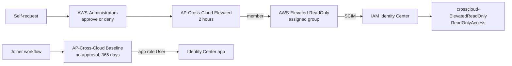

## Package model

| Setting | Baseline | Elevated |
| --- | --- | --- |
| Resource | App role `User` on the Identity Center app | Membership of `AWS-Elevated-ReadOnly` |
| AWS effect | Sign-in scope. Dynamic role groups set the role. | `crosscloud-ElevatedReadOnly`: `ReadOnlyAccess`, 1-hour session |
| Assigned by | Joiner workflow | Self-request in My Access |
| Who can request | Admin direct assignment only | `CrossCloud-Workforce` |
| Approval | None | `AWS-Administrators`, decision within 1 day, justification required |
| Expiry | 365 days | 2 hours, no extension |
| Removed by | Leaver workflow | Expiry, admin removal, or Leaver workflow |

| Object | Owner |
| --- | --- |
| `AWS-Elevated-ReadOnly` | Graph Bicep, `assignedGroups` parameter |
| Permission set and account assignment | [Terraform identity root](../terraform/README.md) |
| Group membership | Elevated package only |
| Catalog, packages, and policies | Entra admin center |

## Steps

1. Deploy the assigned group with Graph Bicep. `main.bicep` takes `assignedGroups` next to the dynamic `groups`.

   ```bash
   az deployment group create --name entra-groups --resource-group <resource-group> --parameters entra/groups/parameters/project.bicepparam --confirm-with-what-if
   ```

   > **Note:** What-if can't evaluate Graph group resources. Confirm the group in the portal after you deploy.

1. Assign the group to the Identity Center enterprise app. SCIM creates the group in AWS.

   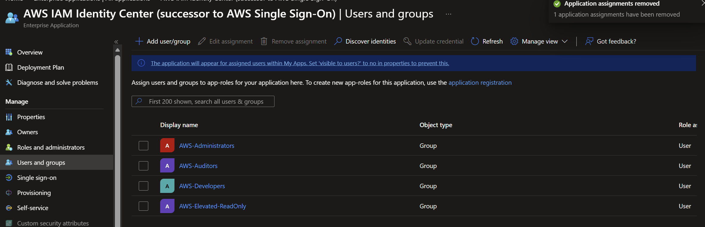

   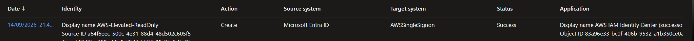

   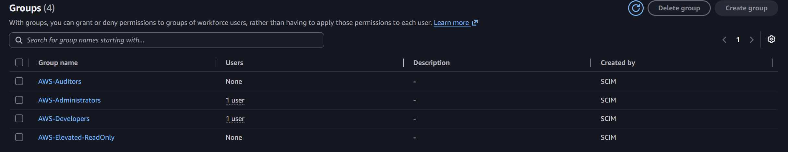

1. Add `elevated_readonly` to the Terraform identity root. Terraform reads the group by name, so run it after SCIM syncs the group.

   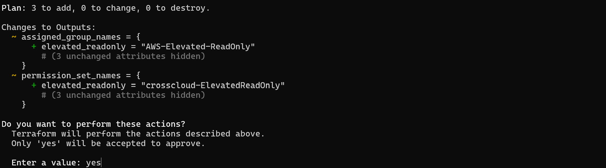

   

   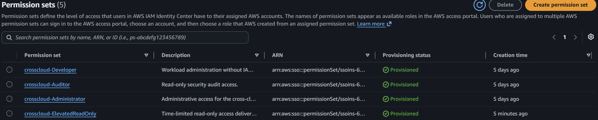

   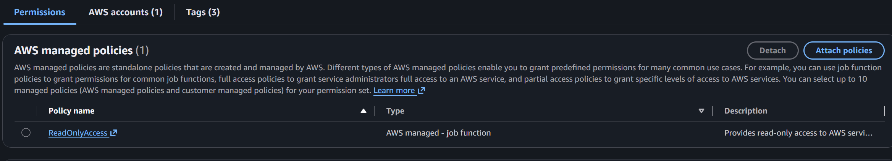

1. Create `AP-Cross-Cloud Elevated` in the `Cross-Cloud Identity` catalog.

   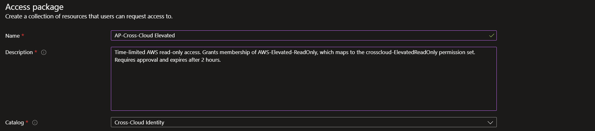

   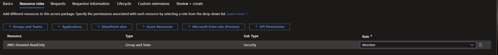

1. Configure the request policy.

   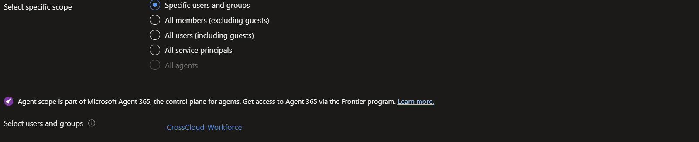

   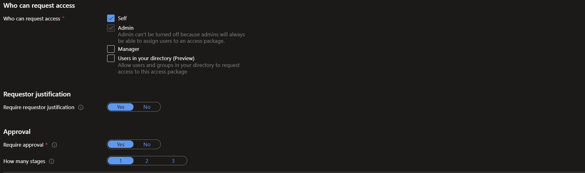

   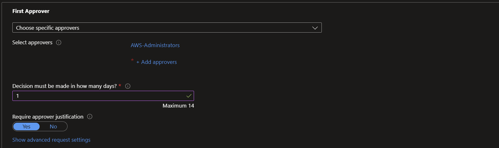

   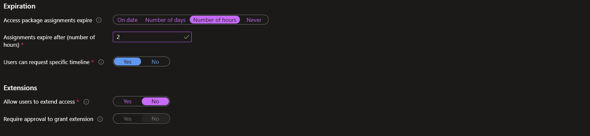

## Limits

- **Admin assignment can't be turned off.** An administrator can assign the elevated package without approval. The audit log records it as `Administrator directly assigns user to access package`.
- **The approver is a group.** Approval survives an approver leaving, but anyone who matches the `AWS-Administrators` rule can approve.
- **Role-group members also reach the app through their group.** The baseline app role is a governed second path, not the only one.
