# Phase 7: Joiner, Mover, and Leaver

**Date:** 2026-09-14

**Goal:** Take one synthetic persona through the full lifecycle and measure each access change in Entra and AWS.

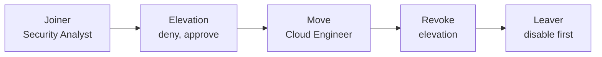

## Setup

| Persona attribute | Value |
| --- | --- |
| Name | Joe Joiner, `joe@<tenant>` |
| Company / department / title | `CrossCloud Identity Project` / `Security` / `Security Analyst` |
| Manager | Administrator |
| Hire date | 2026-09-14 |
| Start state | Disabled |

Workflows run on demand, with scheduling off. Task changes were published as new versions through Microsoft Graph `createNewVersion`.

| Workflow | Version | Tasks in order |
| --- | --- | --- |
| `CrossCloud Joiner` | 2 | Request baseline package → Enable account |
| `CrossCloud Mover` | 1 | Revoke refresh tokens |
| `Offboard cross-cloud leaver` | 2 | Disable account → Revoke refresh tokens → Cancel pending requests → Remove all package assignments |

## Joiner

Version 2 requests the package before it enables the account. Version 1 enabled the account first.

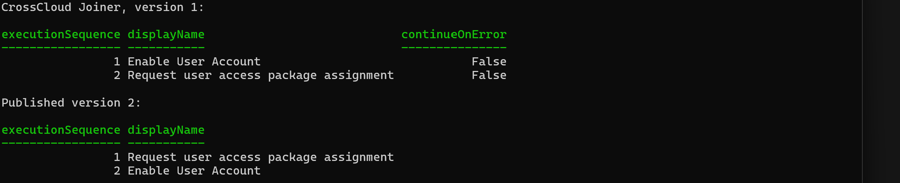

| Time (UTC) | Event |
| --- | --- |
| 20:59:10 | Package assignment created. Account still disabled. |
| 20:59:12 | Account enabled |
| 20:59:35 | Added to `AWS-Auditors` and `CrossCloud-Workforce` |
| 21:00:08 | Baseline app role delivered |

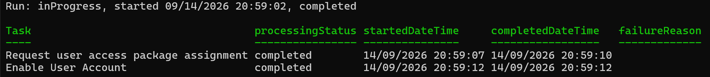

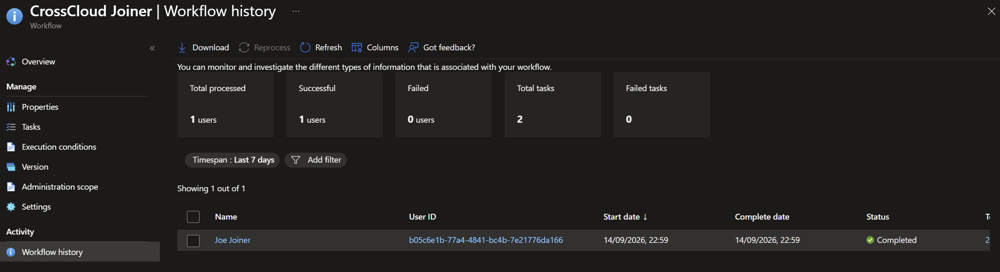

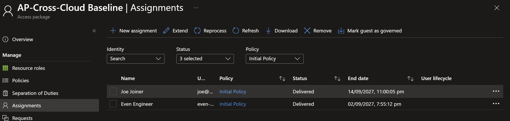

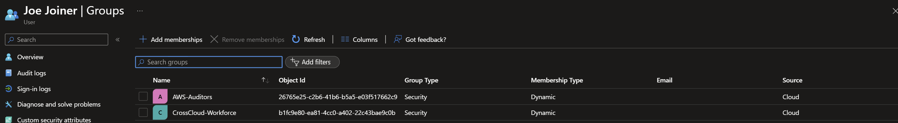

SCIM created Joe in AWS. The first sign-in used MFA and showed only the Auditor role.

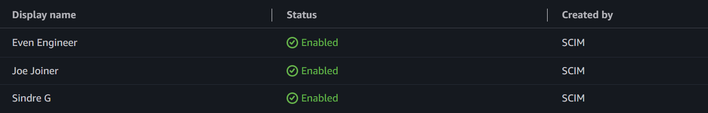

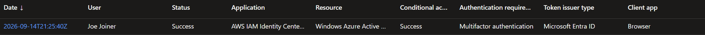

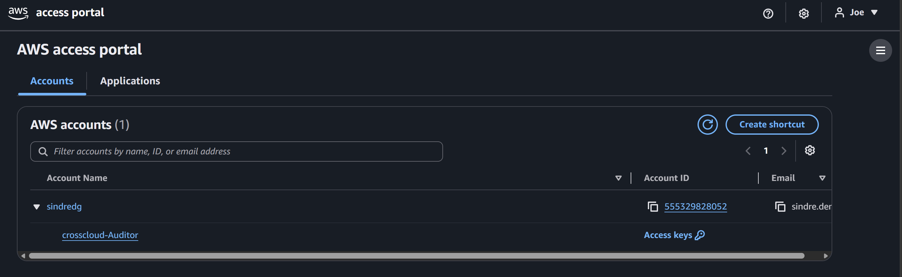

## Mover

### Elevation

| Time (UTC) | Event |
| --- | --- |
| 21:53:52 | Request 1 submitted |
| 21:57:45 | Request 1 denied |
| 22:00:57 | Request 2 submitted |
| 22:02:03 | Request 2 approved |
| 22:02:16 | Added to `AWS-Elevated-ReadOnly` |

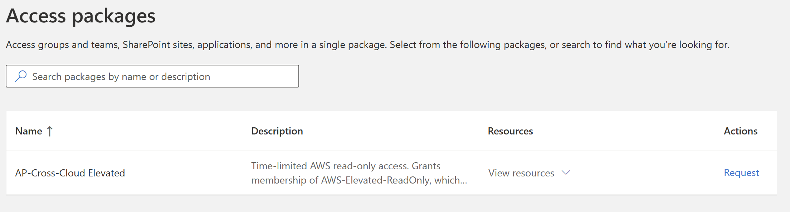

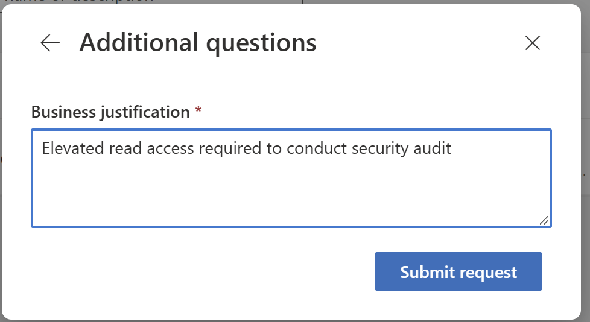

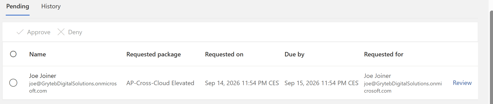

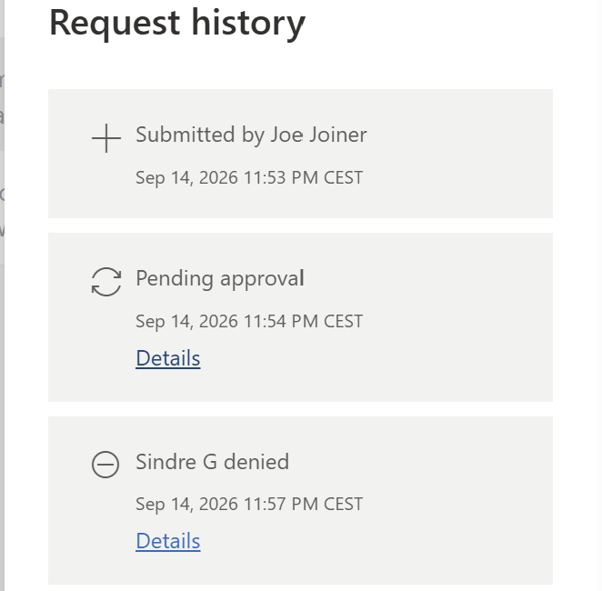

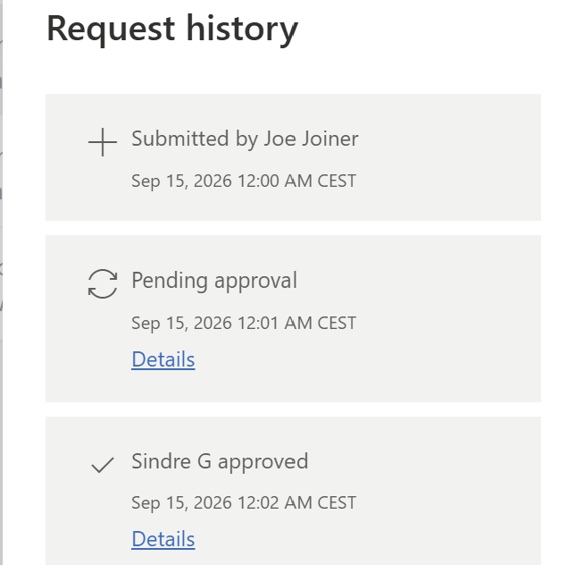

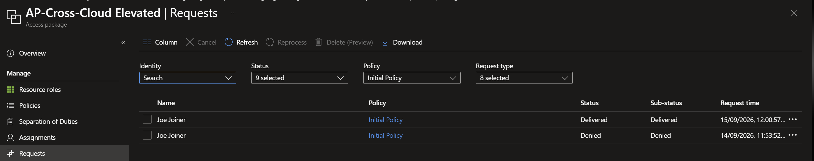

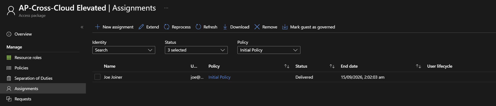

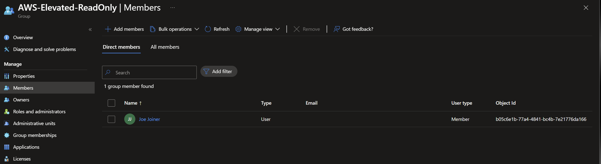

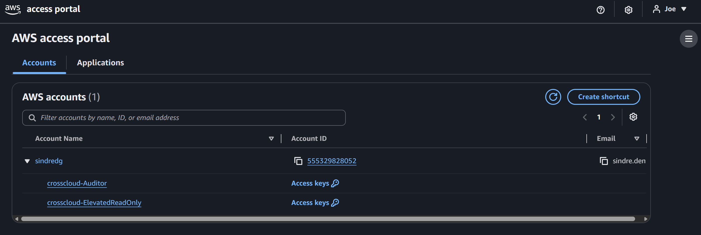

### Role change

| Time (UTC) | Event |
| --- | --- |
| 22:17:00 | Department and title set to `Cloud Platform` / `Cloud Engineer` |
| 22:17:24 | `AWS-Auditors` → `AWS-Developers` |
| 22:18:38 | Refresh tokens revoked by the Mover workflow |

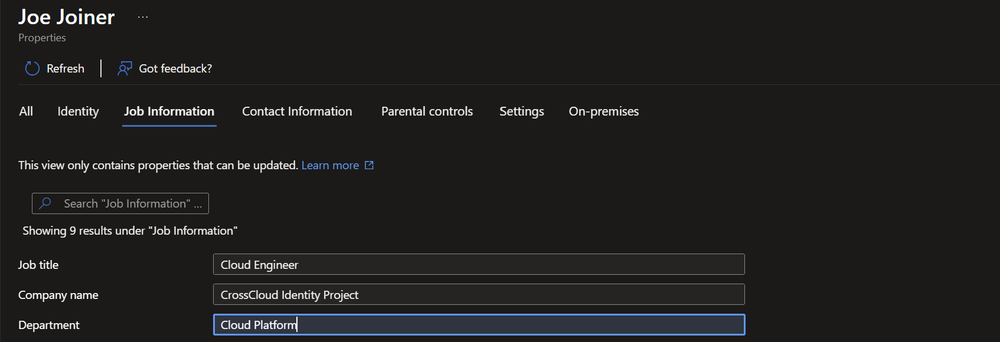

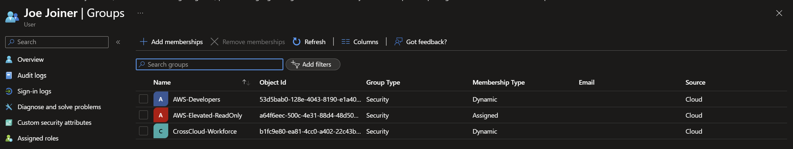

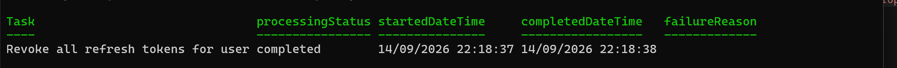

The elevation survived the role change. Package access and attribute-driven roles are independent.

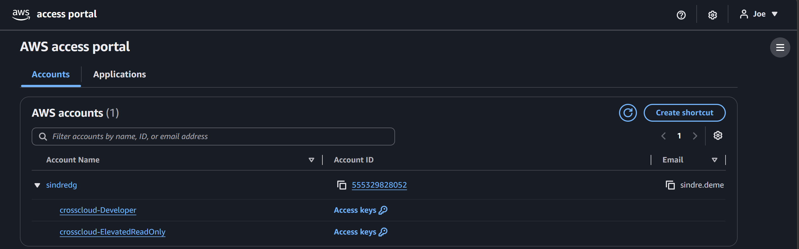

### Revoke elevation

| Time (UTC) | Event |
| --- | --- |
| 22:28:24 | Administrator removes the elevated assignment |
| 22:28:27 | Removed from `AWS-Elevated-ReadOnly` |
| 22:34:06 | SCIM updates the group in AWS |

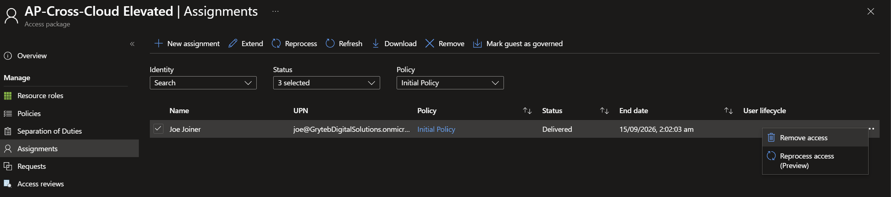

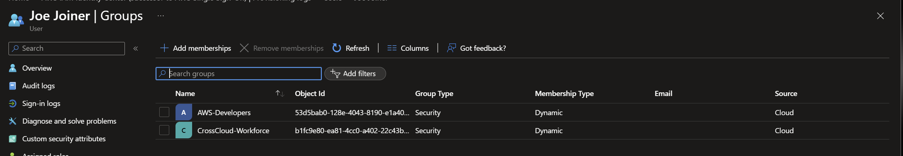

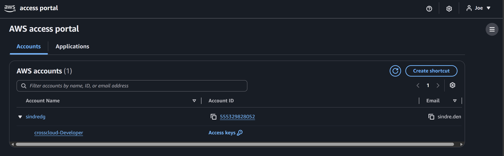

## Leaver

Before the run, Joe held an AWS CLI session.

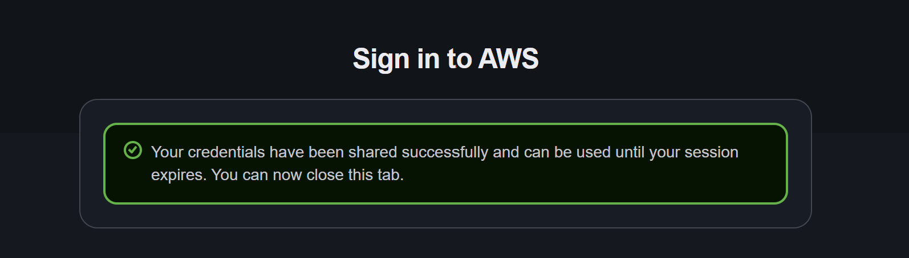

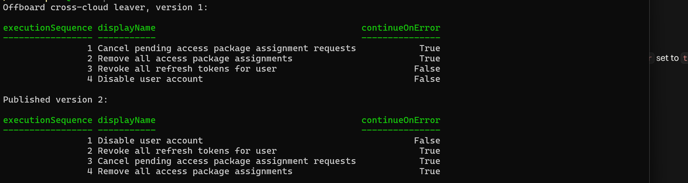

| Time (UTC) | Event |
| --- | --- |
| 22:44:12 | Account disabled |
| 22:44:19 | Refresh tokens revoked |
| 22:44:30 | Baseline assignment removed |
| 22:44:43 | Removed from `AWS-Developers` and `CrossCloud-Workforce` |
| 22:45:03 | New sign-in blocked: `AADSTS50057` |
| 22:45:13 | Identity Center app role removed |
| 22:54:48 | SCIM disables Joe in AWS |

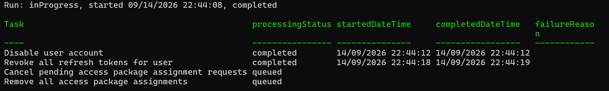

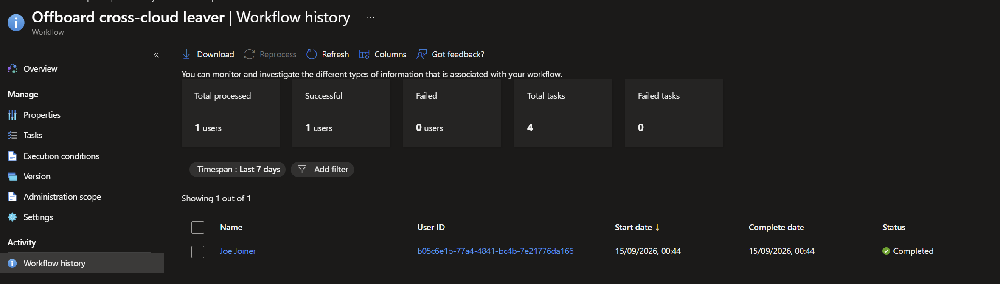

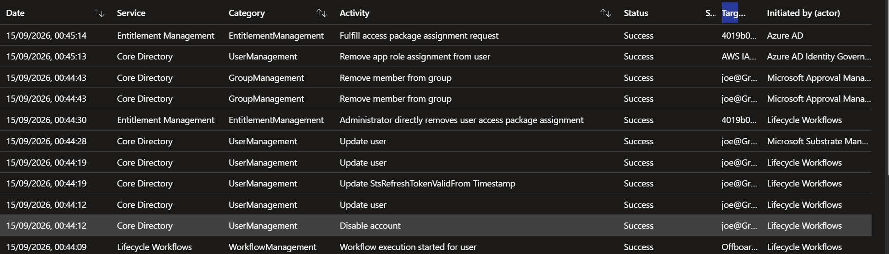

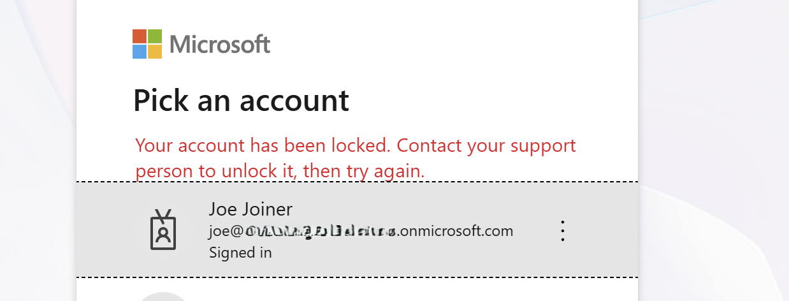

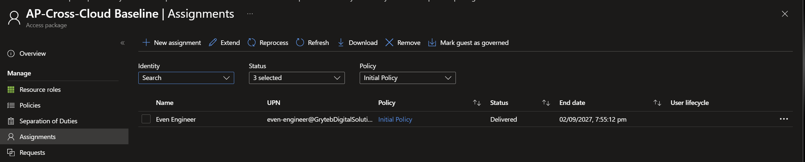

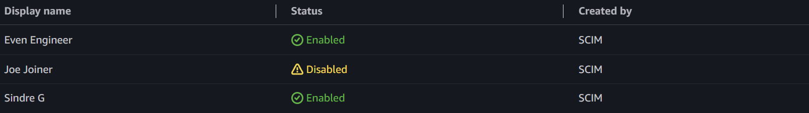

## Troubleshooting

| Symptom | Cause | Fix |
| --- | --- | --- |
| SCIM create fails. The portal shows `UpdateForUnconnectedEntry`; the log shows `400 name: The attribute name is required`. | AWS requires `name.givenName` and `name.familyName`. The persona had no first or last name. | Set the first and last name, then provision on demand. |

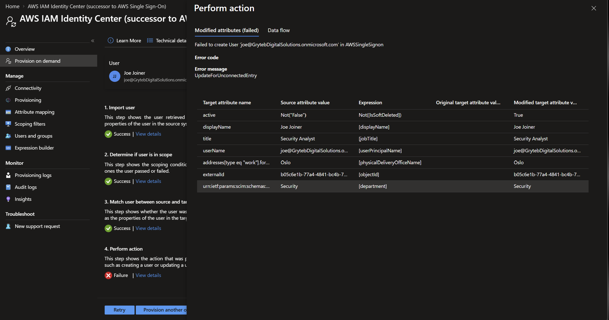

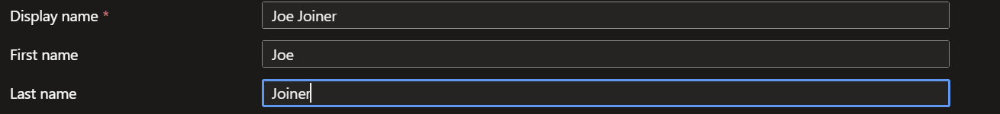

## Limits

- **Assigned while disabled, delivered after.** The package assignment started while the account was disabled, but the app role arrived 55 seconds after enablement. The evidence proves delivery before first sign-in, not delivery while disabled.
- **Existing AWS sessions outlive the Leaver.** A session issued before disablement stayed usable after SCIM disabled the user. Role sessions last until the permission set session ends.
- **SCIM lags containment.** AWS deactivation followed Entra disablement by 10 minutes.
- **The 2-hour expiry wasn't observed.** An administrator revoked the elevation instead.
